# 说明

关于GPU资源，默认的分配规则是整张显卡的全部核心和内存。 当使用腾讯的Elastic GPU时，能实现分配给Pod更小的GPU分片。

环境

* OKE：Oracle云的K8s服务
* X86 Node Pool:  1台1 OCPU  16GB内存，VM.Standard.E4.Flex/VM.Standard.E3.Flex/VM.Standard3.Flex 等Flex型号都行
* GPU Node Pool：1台VM.GPU2.1（[折扣前价格](https://www.oracle.com/cloud/price-list/#compute-gpu)$1.28/h , Ashburn,Frankfurt ,Tokyo区域有此型号），或者1台VM.GPU3.1（$2.95/h），或者BM.GPU.A10.4($8/h)


# 创建OKE集群

##### Step 1. 创建OKE

使用快速创建方案创建OKE

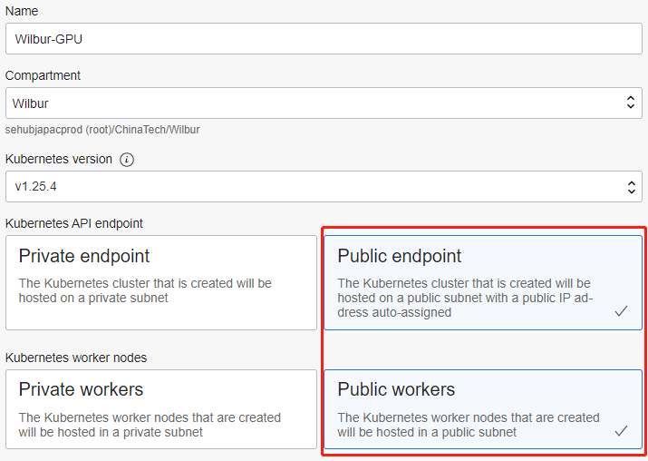

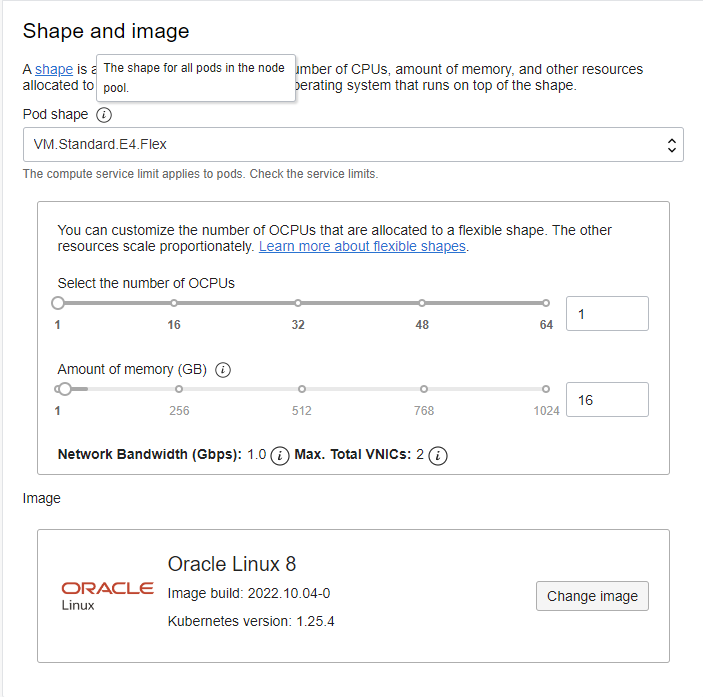

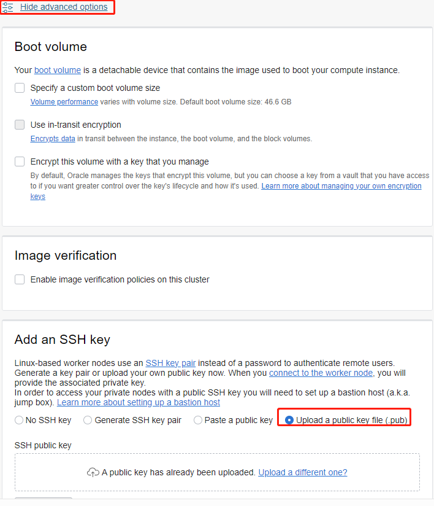

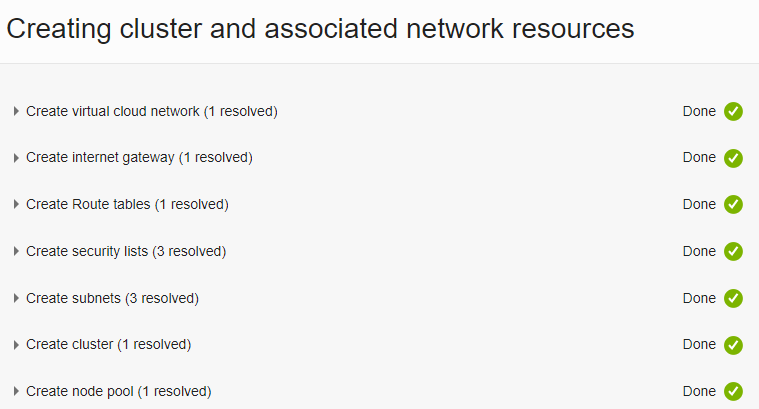

等待约5分钟，OKE状态和里面的Nood Pool中的Node状态正常


##### Step 2. 添加GPU节点池

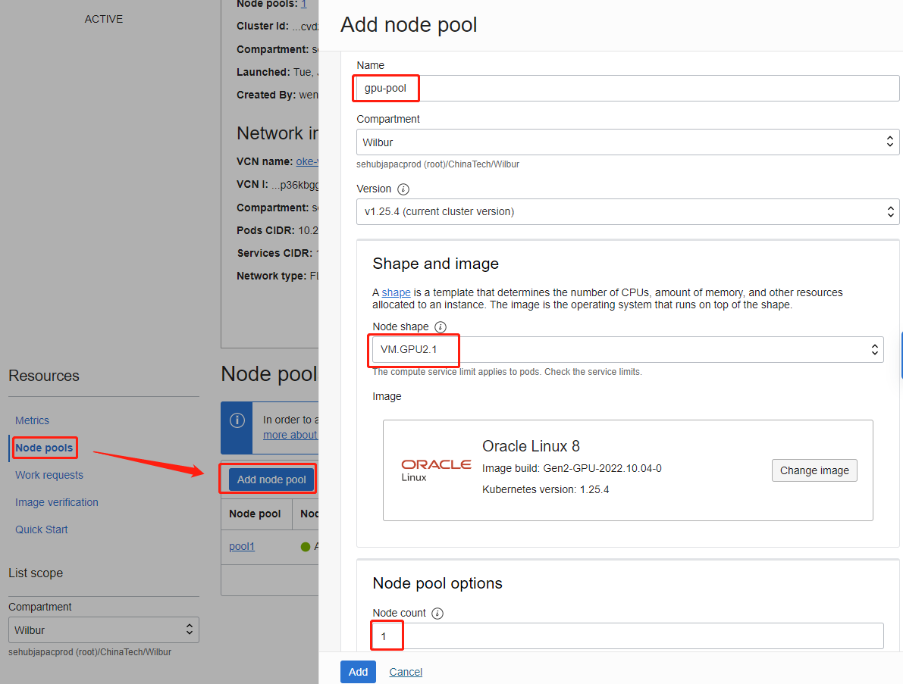

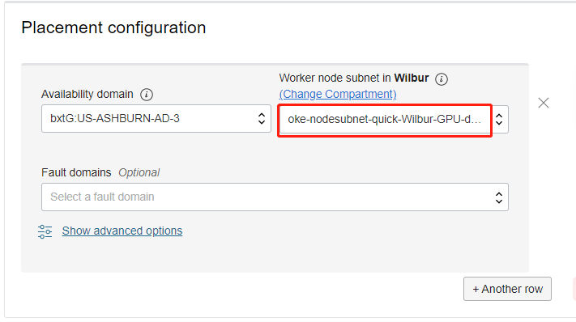

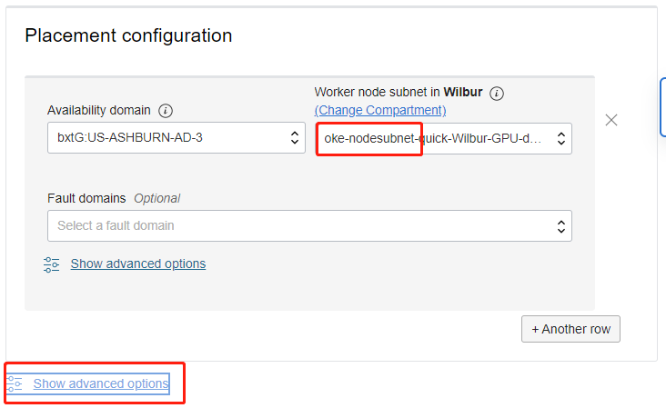

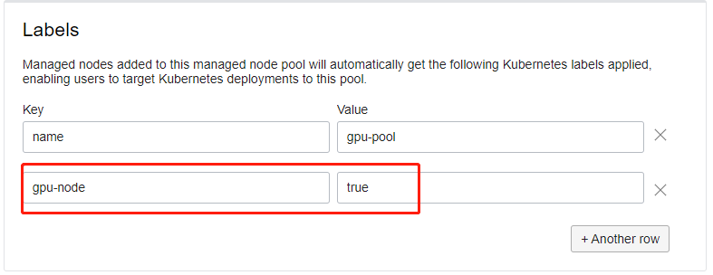

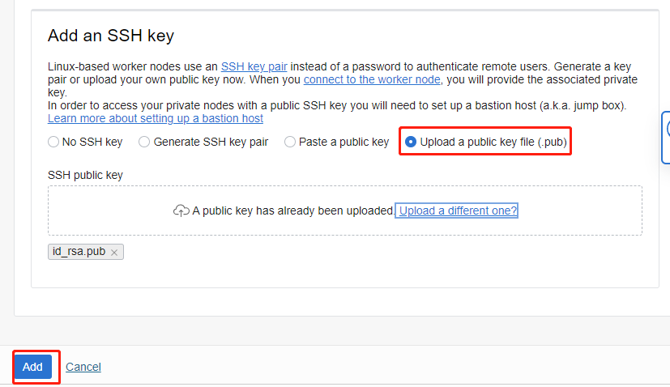

如果是BM.GPU.A10.4机型，选择如下(这是我创建的第3个NodePool，名字变化了一下，系统为默认的7.9)


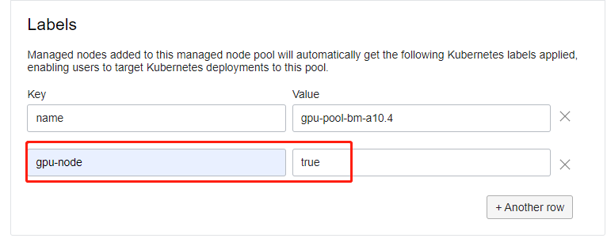

# 安装Elastic GPU

##### Step 1. 下载并修改k8s yaml

从github下载ElsticGPU所需的资源定义

```shell
#4个自定义资源
https://github.com/elastic-ai/elastic-gpu/tree/master/manifests/

#1个K8s扩展调度器
https://github.com/elastic-ai/elastic-gpu-scheduler/tree/master/deploy/

#1个执行代理
https://github.com/elastic-ai/elastic-gpu-agent/tree/master/deploy/
```

 修改执行代理elastic-gpu-agent.yaml的定义，让其能且只能被调度到GPU的节点上(GPU Node上有污点)

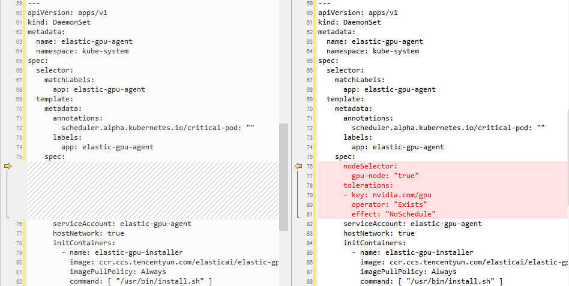

```yaml
    spec:
      nodeSelector:
        gpu-node: "true"
      tolerations:
      - key: nvidia.com/gpu
        operator: "Exists"
        effect: "NoSchedule"
```

##### Step 2. 上传到Cloud Shell

把Step 1中的6个文件上传到Cloud Shell中

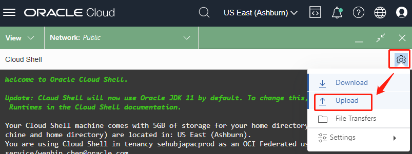

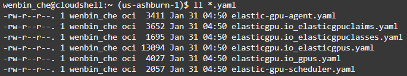

##### Step 3. 安装ElasticGPU

```shell
kubectl apply -f elasticgpu.io_elasticgpuclaims.yaml
kubectl apply -f elasticgpu.io_elasticgpuclasses.yaml
kubectl apply -f elasticgpu.io_elasticgpus.yaml
kubectl apply -f elasticgpu.io_gpus.yaml
kubectl apply -f elastic-gpu-scheduler.yaml
kubectl apply -f elastic-gpu-agent.yaml
```

可以看到Elastic GPU的调度器和代理都启动了。同时还有OKE默认的Nvidia官方插件

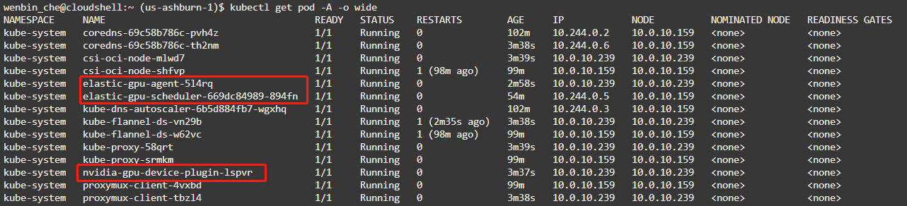

找到GPU节点的名称（也就是GPU节点的私网IP），查看GPU节点的描述

```shell
kubectl get node  --show-labels  | grep gpu-node
GPU_NODE_PRIVATE_IP=`kubectl get node --show-labels  | grep gpu-node | awk '{print $1}'`
kubectl describe node $GPU_NODE_PRIVATE_IP
```

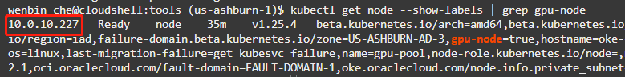

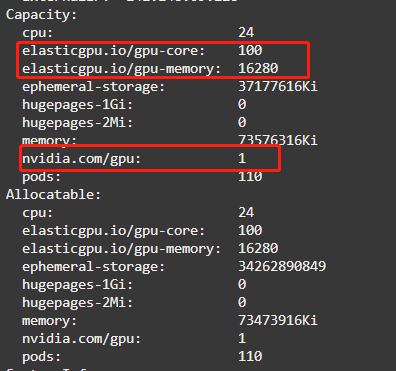

可以看到，Elastic GPU 把1张GPU显卡分成了100份，显存16GB，与VM.GPU2.1[价格页](https://www.oracle.com/cloud/price-list/#compute-gpu)中描述一致。

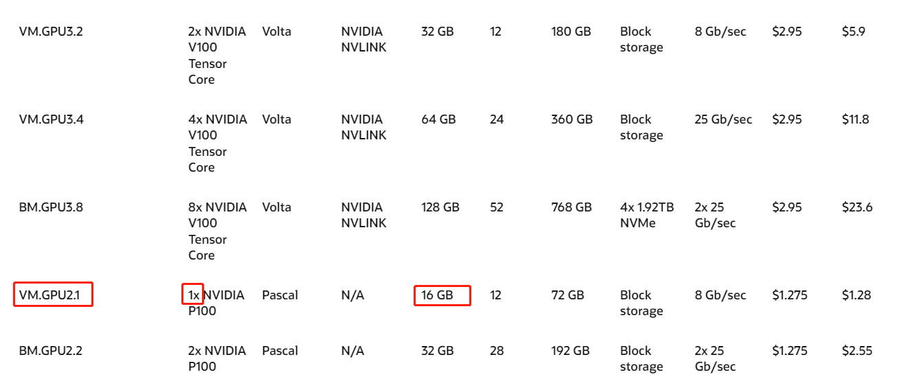

# GPU分片测试

##### Step 1. 准备测试资源

准备GPU分片 qgpu-class.yaml

```yaml
apiVersion: elasticgpu.io/v1alpha1
kind: ElasticGPUClass
metadata:
  name: gpushare-egpuclass
provisioner: gpushare.provisioner.elasticgpu.io
#reclaimPolicy: Retain
#egpuBindingMode: Immediate
---
apiVersion: elasticgpu.io/v1alpha1
kind: ElasticGPUClaim
metadata:
  name: gpushare-egpuc-1
spec:
  elasticGPUClassName: gpushare-egpuclass
  resources:
    requests:
      gpushare.provisioner.elasticgpu.io/gpu-core: 1
      gpushare.provisioner.elasticgpu.io/gpu-memory: 2
---
apiVersion: elasticgpu.io/v1alpha1
kind: ElasticGPUClaim
metadata:
  name: gpushare-egpuc-2
spec:
  elasticGPUClassName: gpushare-egpuclass
  resources:
    requests:
      gpushare.provisioner.elasticgpu.io/gpu-core: 1
      gpushare.provisioner.elasticgpu.io/gpu-memory: 1
```

*上面的定义跟GitHub上Readme.md的Demo有区别，官方Demo里ElasticGPUClaim用spec.egpuClassName，但是我们发现elasticgpu.io_elasticgpuclaims.yaml里定义的是spec.elasticGPUClassName。另外，下面的test.yaml在Github Readme.md中也是有很多错误。相比较而言，官方的谷歌文档[Elastic GPU: Using CRDs to manage GPU Resource in Kubernetes](https://docs.google.com/document/d/1kJzYEeGC6TXJEP40PRaBE3wm-ZujWnhvEnIHluWx0tc/edit?usp=sharing)比较准确*

准备 qgpu-test.yaml, 下面的 "-d 300" 表示执行300s 后退出

```yaml
apiVersion: v1
kind: Pod
metadata:
  name: test-cuda-1
  annotations:
    egpuc.elasticgpu.io/test1: gpushare-egpuc-1
spec:
  restartPolicy: OnFailure
  containers:
  - name: dcgmproftester11
    image: nvidia/samples:dcgmproftester-2.0.10-cuda11.0-ubuntu18.04
    args: ["--no-dcgm-validation", "-t 1004", "-d 300"]
    securityContext:
      capabilities:
        add: ["SYS_ADMIN"]
  nodeSelector:
    gpu-node: "true"
  tolerations:
  - key: nvidia.com/gpu
    operator: "Exists"
    effect: "NoSchedule"
---
apiVersion: v1
kind: Pod
metadata:
  name: test-cuda-2
  annotations:
    egpuc.elasticgpu.io/test1: gpushare-egpuc-2
spec:
  restartPolicy: OnFailure
  containers:
  - name: dcgmproftester11
    image: nvidia/samples:dcgmproftester-2.0.10-cuda11.0-ubuntu18.04
    args: ["--no-dcgm-validation", "-t 1004", "-d 300"]
    securityContext:
      capabilities:
        add: ["SYS_ADMIN"]
  nodeSelector:
    gpu-node: "true"
  tolerations:
  - key: nvidia.com/gpu
    operator: "Exists"
    effect: "NoSchedule"
```


##### Step 2. 运行测试

```shell
kubectl apply -f qgpu-class.yaml
kubectl apply -f qgpu-test.yaml
```

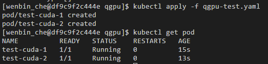

看看效果

```shell
#上传你的ssh私钥，比如id_rsa
chmod 600 id_rsa

kubectl get pod 

GPU_NODE_PRIVATE_IP=`kubectl get node --show-labels  | grep gpu-node | awk '{print $1}'`
kubectl describe node $GPU_NODE_PRIVATE_IP

GPU_NODE_PUBLIC_IP=`kubectl get node -o wide --show-labels  | grep gpu-node | awk '{print $7}'`
ssh opc@$GPU_NODE_PUBLIC_IP -i id_rsa "nvidia-smi"
#如果提示是否连接，需要输入yes
```

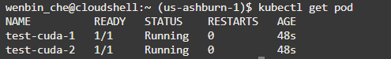

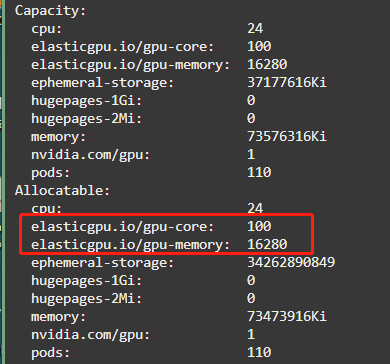

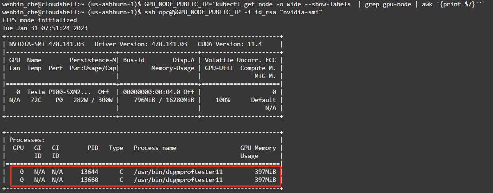

可以看到2个Pod中的CUDA程序都已经同时执行了。

*但是 kubectl describe node $GPU_NODE_PRIVATE_IP 的时候，看到显卡可分配额度还是100份GPU和全部的16GB内存，挺奇怪的。*


BM.GPU.A10.4的效果类似


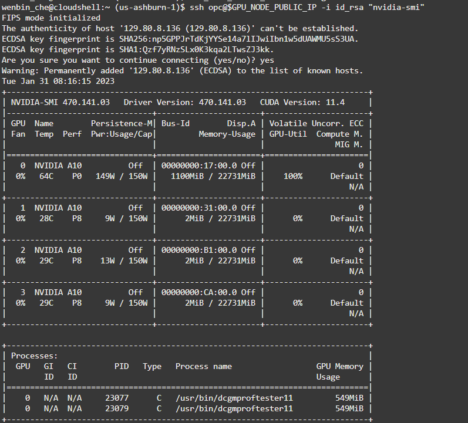

# 清理资源

OKE的控制面板免费（Master Node免费），但是WorkNode不免费，可以将pool1 (X86) 和 gpu-pool  (GPU)都缩容到0台Node。等需要再次测试的时候，只需要重新扩容到1台即可

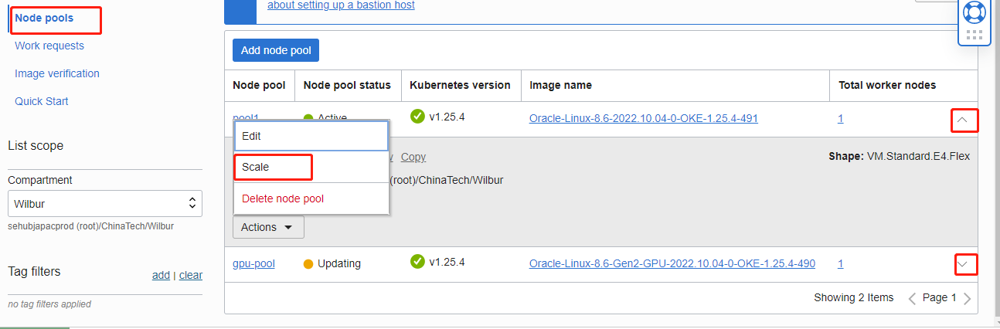


# 相关资料

* https://github.com/elastic-ai/elastic-gpu
* [Elastic GPU: Using CRDs to manage GPU Resource in Kubernetes](https://docs.google.com/document/d/1kJzYEeGC6TXJEP40PRaBE3wm-ZujWnhvEnIHluWx0tc/edit?usp=sharing)