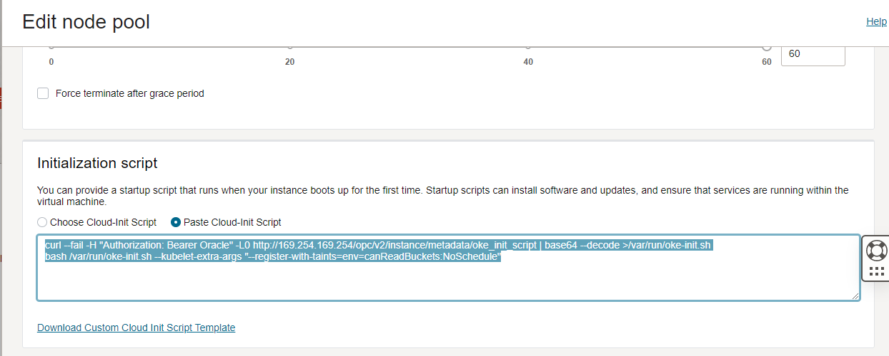

##### Step . 添加污点

```shell
curl --fail -H "Authorization: Bearer Oracle" -L0 http://169.254.169.254/opc/v2/instance/metadata/oke_init_script | base64 --decode >/var/run/oke-init.sh
bash /var/run/oke-init.sh --kubelet-extra-args "--register-with-taints=env=canReadBuckets:NoSchedule"
```




##### Step . 


```shell
sudo dnf -y install oraclelinux-developer-release-el8
sudo dnf -y install python36-oci-cli
oci os ns get --auth instance_principal
```

