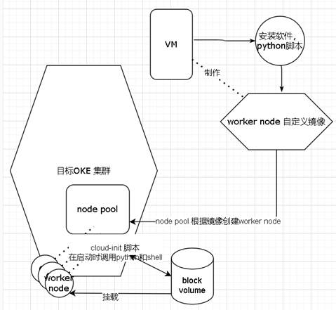
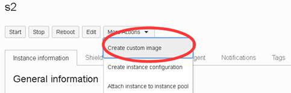
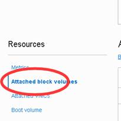
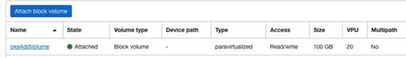
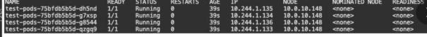

[返回OKE中文文档集](../README.md)

# OKE的WorkerNode外接块存储 

## Table of contents

- [产品版本](#_Toc109292642)

- [方案概述](#_Toc109292643)

- [Node镜像制作](#_Toc109292644)

- [Policy配置](#_Toc109292645)

- [脚本准备](#_Toc109292646)

- [安装脚本所需依赖](#_Toc109292647)

- [脚本完整代码](#_Toc109292648)

- [创建自定义镜像](#_Toc109292649)

- [初始化环境变量](#_Toc109292650)

- [创建OKE集群](#_Toc109292651)

- [创建node  pool](#_Toc109292652)

  

## 产品版本

- OCI云平台

- OKE

- CentOS 7.9


## 方案概述

先将要安装和配置的软件安装在一个VM，使其成为node pool创建node时的自定义镜像，在node 被拉起的时候，会执行cloud-init初始化运行python和shell脚本去创建块存储并挂载给node实例，并把需要的目录按照需求mount到块存储设备。



## Node镜像制作

OKE 我们能做的只有worker node的镜像，所以将要安装的脚本或者软件都安装其中，再制作成自定义镜像，预备给之后创建node pool的时候使用这个镜像。

首先找一个干净的VM，例如本文中采用centos7.9，进入这个VM，安装配置软件，最终将这个VM 导出自定义镜像


## Policy配置

配置worker node，让其可以运行python API 创建和挂载block volume

```
allow dynamic-group workernodes to manage volume-family in compartment xxxx
```

 

## 脚本准备

### 安装脚本所需依赖

使用root 用户在当前worker node的shell 运行

如果是CentOS 7.9作为操作系统 

```
sudo yum -y update
sudo yum -y groupinstall "Development Tools"
sudo yum -y install gcc wget openssl-devel bzip2-devel libffi-devel
sudo yum install -y python3
sudo pip3 install setuptools_rust
```

 

python依赖库pip相关：

```
pip3 install -U pip
pip3 install requests
pip3 install oci
```


### 脚本完整代码

[oke_attachbv.py](./files)

将上面的文件放入到下面位置

```
/usr/local/bin/oke_attachbv.py
```

Root用户运行

```
chmod +rx /usr/local/bin/oke_attachbv.py
```

使其拥有合适的权限


## 创建自定义镜像

到这个制作好的node 的instance 页面，点击more actions -> create custom image



待创建成功后，记录下ocid，以备之后创建node pool时使用

  

## 初始化环境变量

进入cloud shell 或者任一装有oci 命令行的环境运行下述命令

按照实际情况填写环境的参数

```
export compartment=ocid1.compartment.oc1..aaaaaaaarnqeeoclslkgytoefodzxqndovljnxy2cjtl33s7n63dq5zkrkja

#use OKE VCN 资源
export vcn=ocid1.vcn.oc1.phx.amaaaaaacuco5yqajzag3qe2fjpmilxnhehtr4yjsk2gnxqltacwyixxrgoq

#set public endpoint subnet 
export endpointsubnet=ocid1.subnet.oc1.phx.aaaaaaaa5ldhb6is65cisaysdjivrxgnv4uyfooaeyv4gu35qeoqnvoqzgoa

#set endpoint network security gruop 
export endpointnsg=ocid1.networksecuritygroup.oc1.phx.aaaaaaaasrrbpjd4t3j2qzlmnzqhltbuksxxusammy2uov6umsp3yj6f6ttq
export ad1=dTZF:PHX-AD-1

#set public node subnet 
export nodesubnet=ocid1.subnet.oc1.phx.aaaaaaaajiwanh5bdlpj4jqd3j7qm746eznejvdsr6h3uogv4v7v5v7udeka

#set public lb subnet
export svclbsubnet=ocid1.subnet.oc1.phx.aaaaaaaaqscbf2p4mvz2nh6knpa73dyconzmqv5zw3ipffplfgkkkakv3oua

#set pod private subnet
export podsubnet=ocid1.subnet.oc1.phx.aaaaaaaa4okomq7fbs5xdokt6s7juy3mj6kabcb7z7l7xsc7k7eaolespxlq

#set pod network security gruop
export podnsg=ocid1.networksecuritygroup.oc1.phx.aaaaaaaavt5j27swpvfdy33bfeexqo5ucqr2k7ah2fevjsfhopqp3rwwmzja
```

 

## 创建OKE集群

```
oci ce cluster create \
--compartment-id $compartment \
--name npntest-0518 \
--vcn-id $vcn \
--kubernetes-version v1.22.5 \
--service-lb-subnet-ids "[\"$svclbsubnet\"]" \
--endpoint-subnet-id $endpointsubnet \
--endpoint-public-ip-enabled TRUE \
--endpoint-nsg-ids "[\"$endpointnsg\"]" \
--cluster-pod-network-options "[{\"cniType\":\"OCI_VCN_IP_NATIVE\"}]"
```


集群创建成功后，会得到cluster的ocid 以备下一个命令使用

## 创建node pool

请改成实际环境的值

```
oci ce node-pool create \
--cluster-id ocid1.cluster.oc1.ap-singapore-1.aaaaaaaab62nbekgtrtm2gfuii4ovc2qiti24fsl4hxzetixkc22wotgsknq \
--name centos-image-attach-bv \
--node-image-id ocid1.image.oc1.ap-singapore-1.aaaaaaaa35oxkggeazmo33cx22ucnhagl3lofdiw7h3mpqqnghfnecso3hoq \
--compartment-id ocid1.compartment.oc1..aaaaaaaatge7apvmsoo7sirfvd4ov74wfuweoul3vrdeb353bjgmuahtrlua \
--kubernetes-version v1.23.4 \
--node-shape VM.Standard.E4.Flex --node-shape-config='{ "memoryInGBs": 8.0, "ocpus": 2.0 }' \
--placement-configs "[{\"availability-domain\":\"HnmI:AP-SINGAPORE-1-AD-1\", \"subnet-id\":\"ocid1.subnet.oc1.ap-singapore-1.aaaaaaaarczdgxuverfag4xyjpixbv4xa7duddlgupjngvruuserlpjh5tsa\", \"faultDomains\":[\"FAULT-DOMAIN-3\", \"FAULT-DOMAIN-2\", \"FAULT-DOMAIN-1\"]}]" \
--size 1 \
--region=ap-singapore-1 \
--node-metadata="{\"user_data\": \"$(cat oke.sh | base64 -w 0)\"}"
```


其中oke.sh 就是cloud-init 脚本，如下

[oke.sh](./files)

创建完成后，确认这个worker node 有挂载一个块存储，并使用了这个块存储

进入该worker node实例页面

左下角





部署一个deployment 到该OKE 集群，确认k8s正常工作




## (Optional)其他

原版Word文档下载，[OKE的WorkerNode外接块存储.docx](./files)


[返回OKE中文文档集](../README.md)

