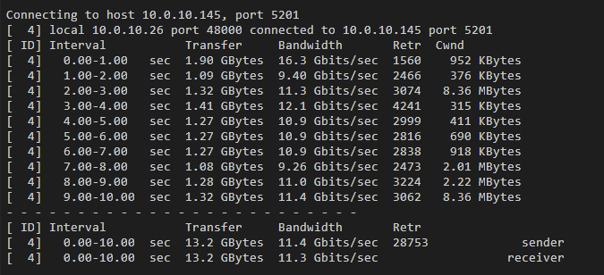

# OKE VCN-Native及Flannel网络性能测试

建立了2个集群

OKE-Flannel： Node Pool配置为2台10 OCPU 10GB内存

OKE-NPN（也就是VCN-Native）： Node Pool配置为2台11 OCPU 11GB内存

## 1.制作测试工具

##### Step 1.  制作测试镜像

编写docker file

```shell
vim dockerfile
```

```shell
FROM centos:7.9.2009

RUN mkdir /root/tools
RUN cd /root/tools
RUN yum install -y wget
RUN wget --no-check-certificate https://iperf.fr/download/fedora/iperf3-3.1.3-1.fc24.x86_64.rpm -O /root/tools/iperf3-3.1.3-1.fc24.x86_64.rpm
RUN rpm -ivh /root/tools/iperf3-3.1.3-1.fc24.x86_64.rpm
COPY iperf-*.sh /root/ 
RUN ls /root/
EXPOSE 5201
WORKDIR /root/
```

编写启动脚本

```shell
echo '/bin/iperf3 -c $IPERF_SERVER_HOST -i 1 w 1M' > iperf-client.sh
echo '/bin/iperf3 -s -i 1' > iperf-server.sh
chmod +x ./*.sh
```

编译并上传镜像

```shell
docker login -u 'sehubjapacprod/oracleidentitycloudservice/xxx@oracle.com' nrt.ocir.io
docker image build . -t iperf:3.1
docker tag iperf:3.1 nrt.ocir.io/sehubjapacprod/iperf:3.1
docker push nrt.ocir.io/sehubjapacprod/iperf:3.1
```

##### Step 2. 部署测试工具

```shell
vim iperf-server.yaml
```

```yaml
apiVersion: apps/v1
kind: DaemonSet
metadata:
  name: iperf-server
spec:
  selector:
    matchLabels:
      app: iperf-server
  template:
    metadata:
      labels:
        app: iperf-server
    spec:
      containers:
      - name: iperf-server
        image: nrt.ocir.io/sehubjapacprod/iperf:3.2
        imagePullPolicy: Always
        command:
          - sh
          - "/root/iperf-server.sh"
        ports:
        - containerPort: 5201
---
kind: Service
apiVersion: v1
metadata:
  name: iperf-lb
spec:
  selector:
    app: iperf-server
  type: LoadBalancer
  ports:
  - name: http
    port: 5201
    targetPort: 5201
---
kind: Service
apiVersion: v1
metadata:
  name: iperf-nlb
  annotations:
    oci.oraclecloud.com/load-balancer-type: "nlb"
spec:
  selector:
    app: iperf-server
  type: LoadBalancer
  ports:
  - name: iperf
    port: 5201
    targetPort: 5201

```


```shell
vim iperf-client.yaml
```

```yaml
apiVersion: apps/v1
kind: Deployment
metadata:
  name: iperf-client
spec:
  selector:
    matchLabels:
      app: iperf-client
  replicas: 1
  template:
    metadata:
      labels:
        app: iperf-client
    spec:
      containers:
      - name: iperf-client
        image: nrt.ocir.io/sehubjapacprod/iperf:3.2
        imagePullPolicy: Always
        env:
          - name: "IPERF_SERVER_HOST"
            value: "iperf-lb"
        command:
          - sleep
          - "3600"
        ports:
        - containerPort: 5201
```

在Flannel集群和VCN-Native集群都部署上客户端和服务端

```shell
kubectl apply -f iperf-server.yaml
kubectl apply -f iperf-client.yaml
```

部署完后，手工将LB的带宽改为Flex 1024Mbps ~ 2048Mbps


##### Step 3. 部署结果

###### VCN-Native部署结果
node:

```shell
NAME          STATUS   ROLES   AGE    VERSION   INTERNAL-IP   EXTERNAL-IP   OS-IMAGE                  KERNEL-VERSION                      CONTAINER-RUNTIME
10.0.10.20    Ready    node    150m   v1.24.1   10.0.10.20    <none>        Oracle Linux Server 8.6   5.4.17-2136.311.6.1.el8uek.x86_64   cri-o://1.24.1-76.el8
10.0.10.225   Ready    node    149m   v1.24.1   10.0.10.225   <none>        Oracle Linux Server 8.6   5.4.17-2136.311.6.1.el8uek.x86_64   cri-o://1.24.1-76.el8
```
pod
```
NAME                            READY   STATUS    RESTARTS      AGE   IP            NODE          NOMINATED NODE   READINESS GATES
iperf-client-54d6bc7b5c-j2j9w   1/1     Running   1 (38m ago)   98m   10.0.10.26    10.0.10.225   <none>           <none>
iperf-server-t4v67              1/1     Running   0             98m   10.0.10.145   10.0.10.20    <none>           <none>
iperf-server-vdhvg              1/1     Running   0             98m   10.0.10.150   10.0.10.225   <none>           <none>
```

service::
```
NAME         TYPE           CLUSTER-IP     EXTERNAL-IP       PORT(S)          AGE
iperf-lb     LoadBalancer   10.96.110.87   193.122.180.156   5201:32164/TCP   80m
kubernetes   ClusterIP      10.96.0.1      <none>            443/TCP          96m
```

###### Flannel部署结果
node:

```shell
NAME         STATUS   ROLES   AGE    VERSION   INTERNAL-IP   EXTERNAL-IP   OS-IMAGE                  KERNEL-VERSION                      CONTAINER-RUNTIME
10.0.10.41   Ready    node    155m   v1.24.1   10.0.10.41    <none>        Oracle Linux Server 8.6   5.4.17-2136.314.6.2.el8uek.x86_64   cri-o://1.24.1-76.el8
10.0.10.64   Ready    node    155m   v1.24.1   10.0.10.64    <none>        Oracle Linux Server 8.6   5.4.17-2136.314.6.2.el8uek.x86_64   cri-o://1.24.1-76.el8
```
pod
```
NAME                            READY   STATUS    RESTARTS      AGE    IP             NODE         NOMINATED NODE   READINESS GATES
iperf-client-54d6bc7b5c-bchvx   1/1     Running   1 (44m ago)   104m   10.244.1.9     10.0.10.41   <none>           <none>
iperf-server-c8qft              1/1     Running   0             105m   10.244.1.8     10.0.10.41   <none>           <none>
iperf-server-xdx27              1/1     Running   0             105m   10.244.0.136   10.0.10.64   <none>           <none>
```

service::
```
NAME         TYPE           CLUSTER-IP      EXTERNAL-IP       PORT(S)             AGE
iperf-lb     LoadBalancer   10.96.185.173   193.122.163.226   5201:30686/TCP      106m
kubernetes   ClusterIP      10.96.0.1       <none>            443/TCP,12250/TCP   4h55m
```


## 2. Flannel 与 VCN-Native 网络测试

登录2个OKE集群中的iperf-client

```shell
kubectl --context=ctx-flannel exec iperf-server-56996fc9fc-75ng7 -it -- /bin/sh 
kubectl --context=ctx-npn exec iperf-server-56996fc9fc-j2qdb -it -- /bin/sh
/bin/iperf3 -s -i 1

#在Flannel集群登录：
kubectl --context=ctx-flannel exec -it iperf-client-54d6bc7b5c-bchvx -- /bin/sh

#在VCN-Native集群登录：
kubectl --context=ctx-npn exec -it iperf-client-54d6bc7b5c-j2j9w -- /bin/sh
```


| client         | server                         | 命令                                              | 结果            |
| -------------- | ------------------------------ | ------------------------------------------------- | --------------- |
| Flannel pod    | Flannel pod (另一Node的Pod)    | /bin/iperf3 -c 10.244.0.134 -i 1 w 1M             | 10.3Gbps,很稳定 |
| VCN-Native pod | VCN-Native pod (另一Node的Pod) | /bin/iperf3 -c 10.0.10.145 -i 1 w 1M              | 11.3Gbps,有波动 |
| VCN-Native pod | Flannel pod                    | /bin/iperf3 -c 193.122.163.226 -i 1 w 1M          | 2.12Gbps,很稳定 |
| Flannel pod    | VCN-Native pod                 | /bin/iperf3 -c 193.122.180.156 -i 1 w 1M          | 2.12Gbps,很稳定 |
| VCN-Native pod | Flannel pod                    | /bin/iperf3 -c xxx.xxx.xxx.xxx -i 1 w 1M -u -b 2G | NLB受限，没测   |
| Flannel pod    | VCN-Native pod                 | /bin/iperf3 -c xxx.xxx.xxx.xxx -i 1 w 1M -u -b 2G | NLB受限，没测   |




左边是VCN-Native -> Flannel , 右边是Flannel -> VCN-Native 


