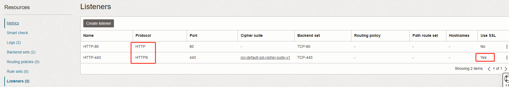
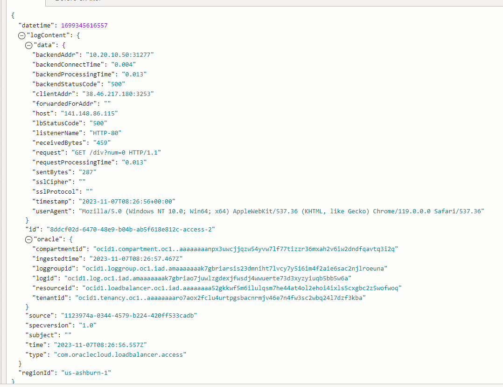

# 在FLB终止SSL/TLS证书与在后端终止SSL/TLS证书

## 1. OKE 的LB 类型Service

当创建OKE(K8s) LoadBalancer类型的Service时，默认情况下会在OCI FLB的Listener中生成一个TCP类型的监听器，则使用“TCP”协议转发，也就是3层转发


此时，如果7层的HTTP返回500等错误状态码，因为TCP层没有异常，所以LB的状态会显示为200，且看不到HTTP协议中的uri信息。


### 1.1 LB的7层HTTP协议注解

在OKE(K8s) LoadBalancer类型的Service中, 如果用注解声明了“HTTP”协议，使用HTTP或HTTPS协议转发，也就是7层转发。

*注意，FLB会根据“HTTP”这个注解值+SSL端口的注解值联合判断哪个端口协议为HTTPS，而不是协议类型“HTTPS”。*

```yaml
service.beta.kubernetes.io/oci-load-balancer-backend-protocol: <协议，"HTTP" 或 "TCP", 默认"TCP">
```



此时可以在FLB的Access日志中看到HTTP的真实状态码及uri



### 1.2 LB的SSL/TLS注解

在OKE(K8s) LoadBalancer类型的Service中, 如果用注解声明了“HTTP”协议，使用HTTP或HTTPS协议转发，也就是7层转发。

 ```shell
     service.beta.kubernetes.io/oci-load-balancer-ssl-ports: <端口号,比如"443">
     service.beta.kubernetes.io/oci-load-balancer-tls-secret: <证书, 如ssl-certificate-secret>
 ```

这时，FLB会终止SSL，往后端发的是普通的HTTP请求，也就是对应的Backend Set中不会启用SSL


### 1.3 LB Backend Set使用SSL/TLS的注解

在LB与OKE服务间使用HTTPS协议，需要开启后端集的SSL（上图圈出的选项）。

参考 https://docs.oracle.com/en-us/iaas/Content/ContEng/Tasks/contengcreatingloadbalancer.htm#contengcreatingloadbalancer_topic-SSLbetweenLBandbackend

```yaml
service.beta.kubernetes.io/oci-load-balancer-tls-backendset-secret: <value, 如ssl-certificate-secret>
```


## 2. 实验步骤

生成自签名证书用于测试，有效期尽量长一些。


```shell
openssl req -x509 -nodes -days 3650 -newkey rsa:2048 -keyout tls.key -out tls.crt -subj "/CN=testlb.oracle.fit/O=Oracle"
kubectl create secret tls ssl-certificate-secret --key tls.key --cert tls.crt
```

参考的nginx配置

```nginx
events {
    worker_connections 2048;
}
http {
    include  mime.types;
    default_type application/octet-stream;
    sendfile  on;
    keepalive_timeout 65s;
    server {
        listen 80;
        #server_name testlb.oracle.fit;
        location / {
            root  /usr/share/nginx/html;
            index index.html index.htm;
        }
        error_page  500 502 503 504 /50x.html;
        location = /50x.html {
            root /usr/share/nginx/html;
        }
    }
    server {
         listen     443 ssl;
         # server_name  testlb.oracle.fit;
       
         ssl_certificate     /etc/nginx/certs/tls.crt;   #证书的位置，使用绝对路径
         ssl_certificate_key /etc/nginx/certs/tls.key;        
 
         ssl_session_cache      shared:SSL:1m;
         ssl_session_timeout    5m;
   
         ssl_ciphers   HIGH:!aNULL:!MD5;
         ssl_prefer_server_ciphers   on;
   
         location / {
             root    /usr/share/nginx/html;
             index   index.html   index.htm;
         }
    }
}
```

保存nginx配置到K8s

```shell
kubectl create configmap nginx-configmap --from-file=nginx.conf
```

Nginx的K8s配置

```nginx
apiVersion: apps/v1
kind: Deployment
metadata:
  name: nginx-deployment
spec:
  replicas: 1
  selector:
    matchLabels:
      app: nginx
  template:
    metadata:
      labels:
        app: nginx
    spec:
      containers:
      - name: nginx
        image: nginx
        imagePullPolicy: IfNotPresent
        ports:
        - containerPort: 80
        volumeMounts:
        - name: nginx-config
          mountPath: /etc/nginx/nginx.conf
          subPath: nginx.conf
          readOnly: true
        - name: nginxcerts
          mountPath: /etc/nginx/certs/
          readOnly: true

    volumes:
      - name: nginx-config
        configMap:
          name: nginx-configmap 
          items:
          - key: nginx.conf
            path: nginx.conf
      - name: nginxcerts
        secret:
          secretName: ssl-certificate-secret
---
kind: Service
apiVersion: v1
metadata:
  name: nginx-http
  annotations:
    oci.oraclecloud.com/load-balancer-type: "lb"
    service.beta.kubernetes.io/oci-load-balancer-backend-protocol: "HTTP"
    service.beta.kubernetes.io/oci-load-balancer-ssl-ports: "443"
    service.beta.kubernetes.io/oci-load-balancer-tls-secret: ssl-certificate-secret
spec:
  selector:
    app: nginx
  type: LoadBalancer
  ports:
  - name: http
    port: 80
    targetPort: 80
  - name: https
    port: 443
    targetPort: 80
---
kind: Service
apiVersion: v1
metadata:
  name: nginx-tcp
spec:
  selector:
    app: nginx
  type: LoadBalancer
  ports:
  - name: http
    port: 80
    targetPort: 80
  - name: https
    port: 443
    targetPort: 443
```

部署nginx

```shell
kubectl apply -f nginx.yaml
```

注意nginx-http这个LB类型的 Service中，LB的443被转发到了Nginx 的80端口。如果希望FLB到后端也是HTTPS协议，那么加上《1.3 LB Backend Set使用SSL的注解》


## 参考文档

* https://docs.oracle.com/en-us/iaas/Content/ContEng/Tasks/contengcreatingloadbalancer.htm
* https://github.com/k8sers/docs/tree/main/%E6%9C%8D%E5%8A%A1%E7%B1%BB%E5%9E%8B%E4%B8%BALoadBalancer%E6%97%B6%E5%A6%82%E4%BD%95%E8%8E%B7%E5%8F%96%E6%BA%90IP
* https://blog.csdn.net/ZhouXin1111112/article/details/129893723
