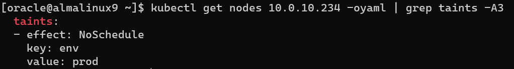

[返回OKE中文文档集](../README.md)

# OKE自动加污点(taints)

OKE可以在创建Pool时自定义给节点添加污点(taints)。
这种情况，在创建Pool时，在"show advanced options"的"Initialization script"里面输入下面脚本内容。

示例中，添加污点，`env=prod:NoSchedule`。请修改为想使用的内容。

```
#!/bin/bash
curl --fail -H "Authorization: Bearer Oracle" -L0 http://169.254.169.254/opc/v2/instance/metadata/oke_init_script | base64 --decode >/var/run/oke-init.sh
bash /var/run/oke-init.sh --kubelet-extra-args "--register-with-taints=env=prod:NoSchedule"
```

查看，

```
kubectl get nodes 10.0.10.234 -oyaml | grep taints -A3
```




[返回OKE中文文档集](../README.md)