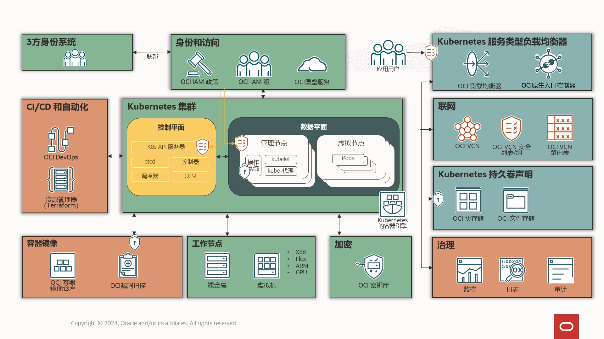

# K8ser

Oracle Cloud Infrastructure Container Engine for Kubernetes （OKE）是一种托管的Kubernets服务，可大规模简化企业级Kubernete的操作。 本站由Oracle中国区员工维护，是官方文档的补充。

为什么选择 OKE？因为 **省心**（高可用，合规）！**省事**（全托管）！和**省钱**(配置灵活，价格实惠)！：

- **完全托管：控制面完全由Oracle管理**，是一个连管理员都没权限破坏的集群。**数据面也可以完全托管**除了由你定义运行哪些业务负载，或者你可以把你的数据面加入OKE。
- **高可用：控制面 99.95% SLA**，可以根据负载自动扩容。 **Worker Node 99.99% SLA**，支持CA自动扩容，支持自动异常节点自动重建。
- **全机型：**ARM，X86，GPU、爆发型、共享型，以及**Flex类型（自由选择CPU及内存）**！甚至可以你的VM加入OKE作为数据面。
- **计费简单： 控制面（MasterNode）不收费**，只收数据面基础资源CPU、内存、存储、网络的费用（增强型集群额外收$0.1/h），而OCI的**基础资源极其实惠**。
- **出海必选：**在**欧美有合规要求**的地区，Oracle是首选！

OKE简介：

[OKE介绍及关键特性说明](OKE%E4%BB%8B%E7%BB%8D%E5%8F%8A%E5%85%B3%E9%94%AE%E7%89%B9%E6%80%A7%E8%AF%B4%E6%98%8E%204634e5ec632e41a4ae25dd59e58d68ff.md)

🍂  [OKE与其他云厂商的K8s PaaS服务对比](https://developer.oracle.com/learn/k8s/k8s_comparison.html) 

[Untitled](Untitled.mp4)

## 1. 基础

---

<aside>
💡 新人最快速方便使用OKE的方法就是1.1中的“快速创建OKE集群”、“安装OCI CLI工具” 以及 “控制OKE集群”

</aside>

### 1.1 管理集群

---

创建集群：

[快速创建OKE集群](%E5%BF%AB%E9%80%9F%E5%88%9B%E5%BB%BAOKE%E9%9B%86%E7%BE%A4%209eac0230b6bb43fea78e03b83bfbfd13.md)

[定制创建OKE集群](%E5%AE%9A%E5%88%B6%E5%88%9B%E5%BB%BAOKE%E9%9B%86%E7%BE%A4%205f9196f7a1024584b57fef3f1c4ca72c.md)

[通过Terraform创建和管理OKE集群](%E9%80%9A%E8%BF%87Terraform%E5%88%9B%E5%BB%BA%E5%92%8C%E7%AE%A1%E7%90%86OKE%E9%9B%86%E7%BE%A4%2047234f3a9b034aa885495edd525331ef.md)

[通过K8s Cluster API创建和管理OKE集群](%E9%80%9A%E8%BF%87K8s%20Cluster%20API%E5%88%9B%E5%BB%BA%E5%92%8C%E7%AE%A1%E7%90%86OKE%E9%9B%86%E7%BE%A4%208c737cf3d2b84112a41b0376a74a2fde.md)

虚拟节点：

[虚拟实例](%E8%99%9A%E6%8B%9F%E5%AE%9E%E4%BE%8B%20d2cbbcf3306f465eab332081e4b8ff7f.md)

[虚拟节点](%E8%99%9A%E6%8B%9F%E8%8A%82%E7%82%B9%20d19ea99dea9442af911ccecb6298d9c4.md)

💵  [托管节点与虚拟节点的功能对比](https://docs.oracle.com/en-us/iaas/Content/ContEng/Tasks/contengcomparingvirtualwithmanagednodes_topic.htm#contengusingvirtualormanagednodes_topic)

[增强型集群与基础集群的功能对比](%E5%A2%9E%E5%BC%BA%E5%9E%8B%E9%9B%86%E7%BE%A4%E4%B8%8E%E5%9F%BA%E7%A1%80%E9%9B%86%E7%BE%A4%E7%9A%84%E5%8A%9F%E8%83%BD%E5%AF%B9%E6%AF%94%208e5ccb54a223451eb9b319d4d9fb1cc9.md)

### 1.2 接入集群

基础工具：

[K8s常用工具](K8s%E5%B8%B8%E7%94%A8%E5%B7%A5%E5%85%B7%20cdb5c831858e418bbdf52e30c8756833.md)

[安装OCI CLI工具](%E5%AE%89%E8%A3%85OCI%20CLI%E5%B7%A5%E5%85%B7%2064b1e22bcc8546e9919c674ec7af882e.md)

接入集群：

[访问OKE集群](%E8%AE%BF%E9%97%AEOKE%E9%9B%86%E7%BE%A4%2076660bb809f74b6a92dc459cf0feea04.md)

[通过证书认证的方式来加速OKE集群的访问](%E9%80%9A%E8%BF%87%E8%AF%81%E4%B9%A6%E8%AE%A4%E8%AF%81%E7%9A%84%E6%96%B9%E5%BC%8F%E6%9D%A5%E5%8A%A0%E9%80%9FOKE%E9%9B%86%E7%BE%A4%E7%9A%84%E8%AE%BF%E9%97%AE%2071935afc97d340a495c9d83ee88a0adf.md)

[通过token认证的方式来加速OKE集群的访问](%E9%80%9A%E8%BF%87token%E8%AE%A4%E8%AF%81%E7%9A%84%E6%96%B9%E5%BC%8F%E6%9D%A5%E5%8A%A0%E9%80%9FOKE%E9%9B%86%E7%BE%A4%E7%9A%84%E8%AE%BF%E9%97%AE%20d4e6b77c37b140cea27a85ead3501e02.md)

[通过CloudShell访问内网的OKE](%E9%80%9A%E8%BF%87CloudShell%E8%AE%BF%E9%97%AE%E5%86%85%E7%BD%91%E7%9A%84OKE%204844d71ed8cc4afc8fd14544ebef909e.md)

[OKE升级](OKE%E5%8D%87%E7%BA%A7%2039c996fe7a3e4e54bec463ba28ef3077.md)

### 1.3 安全

---

[授权OKE使用相关云服务](%E6%8E%88%E6%9D%83OKE%E4%BD%BF%E7%94%A8%E7%9B%B8%E5%85%B3%E4%BA%91%E6%9C%8D%E5%8A%A1%20d45e92f7cf034708ad8a5cf7d973cf05.md)

授权工作负载使用云服务：

[Kubernetes Workload Identity](Kubernetes%20Workload%20Identity%205c6fe7c916aa48a58494810d2e6f3a3d.md)

[授权work node使用云服务](%E6%8E%88%E6%9D%83work%20node%E4%BD%BF%E7%94%A8%E4%BA%91%E6%9C%8D%E5%8A%A1%204d19b263940e49c881359ab506aded1c.md)

[为Pod调用云服务配置OCI用户秘钥](%E4%B8%BAPod%E8%B0%83%E7%94%A8%E4%BA%91%E6%9C%8D%E5%8A%A1%E9%85%8D%E7%BD%AEOCI%E7%94%A8%E6%88%B7%E7%A7%98%E9%92%A5%205266fa1948954aad8a2fe36d45db96d8.md)

[OCI 秘钥钱包](OCI%20%E7%A7%98%E9%92%A5%E9%92%B1%E5%8C%85%209b9596d031744f8a956551163262d41d.md)

[OCIR镜像缺陷扫描](OCIR%E9%95%9C%E5%83%8F%E7%BC%BA%E9%99%B7%E6%89%AB%E6%8F%8F%2070b47a6ac84b42018112f1ef68822033.md)

[OKE证书轮换](OKE%E8%AF%81%E4%B9%A6%E8%BD%AE%E6%8D%A2%208e0d711e685e40a582fc7bce1ea3242c.md)

### 1.4 附加组件

---

[Core DNS自定义域名解析](Core%20DNS%E8%87%AA%E5%AE%9A%E4%B9%89%E5%9F%9F%E5%90%8D%E8%A7%A3%E6%9E%90%20e1deb9c00f4e4ae989739c458bd546e3.md)

[Cluster AutoScaler](Cluster%20AutoScaler%20e447b8bc8008481cb10a2d0c982d433d.md)

[证书管理器](%E8%AF%81%E4%B9%A6%E7%AE%A1%E7%90%86%E5%99%A8%20297541abcf864c0e80dc5f687040d722.md)

[K8s Dashboard](K8s%20Dashboard%200eaaac65c2e94dbf85bfe88fe48365ad.md)

### 1.5 常用功能

---

常用初始化脚本：

💿 [自定义启动盘大小](%E8%87%AA%E5%AE%9A%E4%B9%89Work%20Node%E5%90%AF%E5%8A%A8%E7%9B%98%E5%A4%A7%E5%B0%8F%204c38f3cd028e4dfe9f7c57a14add8946.md)

[OKE为WorkerNode自动加污点(taints)](OKE%E4%B8%BAWorkerNode%E8%87%AA%E5%8A%A8%E5%8A%A0%E6%B1%A1%E7%82%B9(taints)%20846697a17cff4005957110b1ceef4603.md)

[**OKE节点内核优化**](OKE%E8%8A%82%E7%82%B9%E5%86%85%E6%A0%B8%E4%BC%98%E5%8C%96%2018ccffb777b94010951719a524e92cdf.md)

## 2. 网络

---

<aside>
💡 K8s的运行离不开基础网络。在本章节，你将了解如何配置各种网络。

</aside>

### 2.1 网络基础

---

[OKE基本网络配置](OKE%E5%9F%BA%E6%9C%AC%E7%BD%91%E7%BB%9C%E9%85%8D%E7%BD%AE%20ed8b8a4b507b4ad9bbfb392f3b0ecb0d.md)

[OKE网络最佳实践](OKE%E7%BD%91%E7%BB%9C%E6%9C%80%E4%BD%B3%E5%AE%9E%E8%B7%B5%204a87f094262b4f7eb44a534ba433ef19.md)

[通过VCN路由表快捷访问K8s的Service/Pod网络](%E9%80%9A%E8%BF%87VCN%E8%B7%AF%E7%94%B1%E8%A1%A8%E5%BF%AB%E6%8D%B7%E8%AE%BF%E9%97%AEK8s%E7%9A%84Service%20Pod%E7%BD%91%E7%BB%9C%201ff60c9fd5f94997b97a651935f30198.md)

[使用dnstools查看网络](%E4%BD%BF%E7%94%A8dnstools%E6%9F%A5%E7%9C%8B%E7%BD%91%E7%BB%9C%2082ff83bd089d463e936620e7b0939949.md)

### 2.2 Service网络与LB

---

[OKE的服务网络基于Iptables实现 ](OKE%E7%9A%84%E6%9C%8D%E5%8A%A1%E7%BD%91%E7%BB%9C%E5%9F%BA%E4%BA%8EIptables%E5%AE%9E%E7%8E%B0%2026b512d7a5b846ad815cf3c8c018b5fb.md)

[OKE Load Balancer Service](OKE%20Load%20Balancer%20Service%20862d90623e944558910fda8d195644f1.md)

[OKE的LB的HTTPS证书相关配置](OKE%E7%9A%84LB%E7%9A%84HTTPS%E8%AF%81%E4%B9%A6%E7%9B%B8%E5%85%B3%E9%85%8D%E7%BD%AE%20af59bff2fc63428f87c98a4409bf9b46.md)

[OKE的不同LB安全策略注解效果测试](OKE%E7%9A%84%E4%B8%8D%E5%90%8CLB%E5%AE%89%E5%85%A8%E7%AD%96%E7%95%A5%E6%B3%A8%E8%A7%A3%E6%95%88%E6%9E%9C%E6%B5%8B%E8%AF%95%20d294134c95fe41cab712ee53feb6b6ad.md)

[配置OKE LB获取源IP](%E9%85%8D%E7%BD%AEOKE%20LB%E8%8E%B7%E5%8F%96%E6%BA%90IP%20b482a79116c14072864d9f68cbdb8313.md)

[通过OKE设置LB HTTPS端口值](%E9%80%9A%E8%BF%87OKE%E8%AE%BE%E7%BD%AELB%20HTTPS%E7%AB%AF%E5%8F%A3%E5%80%BC%204fa1d8cf00f64d28942053e66c892cc9.md)

### 2.3 Ingress

[在OKE上安装NGINX-Ingress](%E5%9C%A8OKE%E4%B8%8A%E5%AE%89%E8%A3%85NGINX-Ingress%200eeb287defaa49f3be8191cd0dee86a9.md)

[在OKE上安装Ingress-NGINX](%E5%9C%A8OKE%E4%B8%8A%E5%AE%89%E8%A3%85Ingress-NGINX%2085d48a180e72416e99be5645fbdae6da.md)

[**在OKE中安装**Apache APISIX](%E5%9C%A8OKE%E4%B8%AD%E5%AE%89%E8%A3%85Apache%20APISIX%2022ebbfa7d7d84ebf9e6f5e94aa460082.md)

[OCI Native Ingress Controller](OCI%20Native%20Ingress%20Controller%2078a3734716a44287abe31f76a1322adc.md)

[批量创建Ingress](%E6%89%B9%E9%87%8F%E5%88%9B%E5%BB%BAIngress%20f818229b24f542f899fa0c07160f2d15.md)

### 2.4 Pod网络

---

[VCN-Native与Flannel功能对比](VCN-Native%E4%B8%8EFlannel%E5%8A%9F%E8%83%BD%E5%AF%B9%E6%AF%94%2095a0e2b019374a859986b7e573456a67.md)

[VCN-Native与Flannel性能对比](VCN-Native%E4%B8%8EFlannel%E6%80%A7%E8%83%BD%E5%AF%B9%E6%AF%94%205b0d21663d7948549e2a9b60814f7785.md)

### 2.5 服务网格

---

[通过Istio管理多个OKE集群](%E9%80%9A%E8%BF%87Istio%E7%AE%A1%E7%90%86%E5%A4%9A%E4%B8%AAOKE%E9%9B%86%E7%BE%A4%20a9f29e170d9d40c7afec316fd443685e.md)

[OCI Service Mesh](OCI%20Service%20Mesh%205dffa28127fb40af8dd74f5755656273.md)

## 3. 存储

---

<aside>
💡 数据持久化存储一共有3种方案，其中块存储和共享存储是OKE官方实现的，但对象存储并不是。 如果你需要对象存储，应该先考虑是否可以用共享存储替代；如果不行，我们也有开源方案使用OCI Buckets。

</aside>

### 3.1 块存储

---

[自定义Work Node启动盘大小](%E8%87%AA%E5%AE%9A%E4%B9%89Work%20Node%E5%90%AF%E5%8A%A8%E7%9B%98%E5%A4%A7%E5%B0%8F%204c38f3cd028e4dfe9f7c57a14add8946.md)

Pod挂载块存储

[使用StorageClass挂载块存储](%E4%BD%BF%E7%94%A8StorageClass%E6%8C%82%E8%BD%BD%E5%9D%97%E5%AD%98%E5%82%A8%2010d8aa8e69ca4c349619f96e9c9bbb28.md)

[使用PV(Driver)挂载块存储](%E4%BD%BF%E7%94%A8PV(Driver)%E6%8C%82%E8%BD%BD%E5%9D%97%E5%AD%98%E5%82%A8%20d529b8462fe445babdb5b0defadf402c.md)

[Work Node挂载第2块数据盘](Work%20Node%E6%8C%82%E8%BD%BD%E7%AC%AC2%E5%9D%97%E6%95%B0%E6%8D%AE%E7%9B%98%20d584855c6dc44532b4a0c2773b0274b2.md)

### 3.2 共享存储

---

[Work Node挂载共享存储](Work%20Node%E6%8C%82%E8%BD%BD%E5%85%B1%E4%BA%AB%E5%AD%98%E5%82%A8%2011b6a9c5bf4c443eb23d9c1df31bd567.md)

Pod挂载共享存储

[使用StorageClass挂载共享存储](%E4%BD%BF%E7%94%A8StorageClass%E6%8C%82%E8%BD%BD%E5%85%B1%E4%BA%AB%E5%AD%98%E5%82%A8%20f2dc66074bf84256b0a2d0da9da91de9.md)

[使用PV(Driver)挂载共享存储](%E4%BD%BF%E7%94%A8PV(Driver)%E6%8C%82%E8%BD%BD%E5%85%B1%E4%BA%AB%E5%AD%98%E5%82%A8%204420a7d888ee4a2caead24f86b917483.md)

[在OKE上创建基于FileStorage(NFS)的StorageClass](%E5%9C%A8OKE%E4%B8%8A%E5%88%9B%E5%BB%BA%E5%9F%BA%E4%BA%8EFileStorage(NFS)%E7%9A%84StorageClass%208732eb039b6c452ab61f77123567ceeb.md)

### 3.3 对象存储（开源方案，非官方）

---

使用S3的CSI

[OKE使用Yandex的K8s-csi-s3挂载对象存储](OKE%E4%BD%BF%E7%94%A8Yandex%E7%9A%84K8s-csi-s3%E6%8C%82%E8%BD%BD%E5%AF%B9%E8%B1%A1%E5%AD%98%E5%82%A8%2068e174473ade47989e2669be1bdff184.md)

[OKE使用Ctrox的csi-s3挂载对象存储](OKE%E4%BD%BF%E7%94%A8Ctrox%E7%9A%84csi-s3%E6%8C%82%E8%BD%BD%E5%AF%B9%E8%B1%A1%E5%AD%98%E5%82%A8%201b5968d54a01439b8a51a09e848868bd.md)

[Work Node使用s3fs+工作负载使用HostPath挂载对象存储](Work%20Node%E4%BD%BF%E7%94%A8s3fs+%E5%B7%A5%E4%BD%9C%E8%B4%9F%E8%BD%BD%E4%BD%BF%E7%94%A8HostPath%E6%8C%82%E8%BD%BD%E5%AF%B9%E8%B1%A1%E5%AD%98%E5%82%A8%20bbf3219e19854aa98365bc9f2e6d2109.md)

[OKE使用datashim挂载对象存储](OKE%E4%BD%BF%E7%94%A8datashim%E6%8C%82%E8%BD%BD%E5%AF%B9%E8%B1%A1%E5%AD%98%E5%82%A8%20c6fb3fb83fe1400c823aea20fb2213ff.md)

员工访问对象存储

[通过OCI页面管理对象存储中的文件](%E9%80%9A%E8%BF%87OCI%E9%A1%B5%E9%9D%A2%E7%AE%A1%E7%90%86%E5%AF%B9%E8%B1%A1%E5%AD%98%E5%82%A8%E4%B8%AD%E7%9A%84%E6%96%87%E4%BB%B6%20551890f70b5849918c49e52aca2497b6.md)

[通过本地工具连接OCI对象存储](%E9%80%9A%E8%BF%87%E6%9C%AC%E5%9C%B0%E5%B7%A5%E5%85%B7%E8%BF%9E%E6%8E%A5OCI%E5%AF%B9%E8%B1%A1%E5%AD%98%E5%82%A8%202e04bab3a6aa4c5c9f5c77026d5dfa28.md)

[AWS命令行读取OCI Buckets](AWS%E5%91%BD%E4%BB%A4%E8%A1%8C%E8%AF%BB%E5%8F%96OCI%20Buckets%201a75833b081b4ee8a72f67bc4dc7296e.md)

## 4. DevOps

---

<aside>
💡 OCI是一个从开放到发布的、端到端的云原生解决方案

</aside>

### 4.1 镜像仓库

---

[登录OCIR](%E7%99%BB%E5%BD%95OCIR%202cf9469d936a4bc188659bfcf915a210.md)

[推送镜像到OCIR](%E6%8E%A8%E9%80%81%E9%95%9C%E5%83%8F%E5%88%B0OCIR%20c2942542f73a4b55aba5d03120026389.md)

[OKE拉取OCIR中的镜像](OKE%E6%8B%89%E5%8F%96OCIR%E4%B8%AD%E7%9A%84%E9%95%9C%E5%83%8F%207c0ca5759df54a04ba9e2d3824748ac3.md)

[编译容器镜像等常用Docker命令](%E7%BC%96%E8%AF%91%E5%AE%B9%E5%99%A8%E9%95%9C%E5%83%8F%E7%AD%89%E5%B8%B8%E7%94%A8Docker%E5%91%BD%E4%BB%A4%2028fce22054d44b3c8712c98273225183.md)

[在OKE中安装Buildkit](%E5%9C%A8OKE%E4%B8%AD%E5%AE%89%E8%A3%85Buildkit%20ed98899a6362488b9973c8ced811cd20.md)

[Oracle产品镜像仓库](Oracle%E4%BA%A7%E5%93%81%E9%95%9C%E5%83%8F%E4%BB%93%E5%BA%93%20b70aca83101447bf863ed2eddf51196f.md)

### 4.2 制品库

---

[将Maven编译的Java包放入制品库](%E5%B0%86Maven%E7%BC%96%E8%AF%91%E7%9A%84Java%E5%8C%85%E6%94%BE%E5%85%A5%E5%88%B6%E5%93%81%E5%BA%93%2052bb09cafc1442f1b85cdfd3a135edc2.md)

[将npm编译的NodeJS库放入制品库](%E5%B0%86npm%E7%BC%96%E8%AF%91%E7%9A%84NodeJS%E5%BA%93%E6%94%BE%E5%85%A5%E5%88%B6%E5%93%81%E5%BA%93%20643fca24d866433ca4bbc031a87da185.md)

### 4.3 CI/CD

---

[OCI Devops](OCI%20Devops%2077c9ada9318642369af0d42b5c7b3b12.md)

[OKE+Jenkins+ArgoCD+Harbor实现国内CI国外CD模式](OKE+Jenkins+ArgoCD+Harbor%E5%AE%9E%E7%8E%B0%E5%9B%BD%E5%86%85CI%E5%9B%BD%E5%A4%96CD%E6%A8%A1%E5%BC%8F%205601ed87c4b54c0cb559545cc5c42361.md)

## 5. 运维

---

<aside>
💡 OKE可以配合云原生或开源方案来实现保障系统文档运行。

</aside>

### 日志,监控,告警,审计

---

[OKE行为审计](OKE%E8%A1%8C%E4%B8%BA%E5%AE%A1%E8%AE%A1%20413c5f4b10b445f18fdf351ec7f94612.md)

[Grafana+Prometheus监控 ](Grafana+Prometheus%E7%9B%91%E6%8E%A7%20f14ad63eb98349e692f0f7508407099b.md)

[Loki收集OKE日志](Loki%E6%94%B6%E9%9B%86OKE%E6%97%A5%E5%BF%97%2037d7341391cb4ea691d0ab291c7e7442.md)

[OCI LA收集OKE日志](OCI%20LA%E6%94%B6%E9%9B%86OKE%E6%97%A5%E5%BF%97%2063cf7360b1c247068349f5cc6d5ddab5.md)

[使用Fluentd收集OKE日志到OpenSearch](%E4%BD%BF%E7%94%A8Fluentd%E6%94%B6%E9%9B%86OKE%E6%97%A5%E5%BF%97%E5%88%B0OpenSearch%20e3a754e2af9948219f13a5ab31f5b8db.md)

[OCI Logging收集OKE日志](OCI%20Logging%E6%94%B6%E9%9B%86OKE%E6%97%A5%E5%BF%97%20bcef4e73c2a447d4ad8672e5a6686d6b.md)

[访问cadvisor指标数据接口](%E8%AE%BF%E9%97%AEcadvisor%E6%8C%87%E6%A0%87%E6%95%B0%E6%8D%AE%E6%8E%A5%E5%8F%A3%20d7492373f4664ee59d4d619993475e97.md)

[使用kubetail查看日志](%E4%BD%BF%E7%94%A8kubetail%E6%9F%A5%E7%9C%8B%E6%97%A5%E5%BF%97%20bafd6ece4c624c2a8d21199e3611f901.md)

### 高可用/稳定性

---

[OKE自动扩缩容](OKE%E8%87%AA%E5%8A%A8%E6%89%A9%E7%BC%A9%E5%AE%B9%20a3c22d08257b42da814d63e39b3d60db.md)

[OKE跨区域容灾](OKE%E8%B7%A8%E5%8C%BA%E5%9F%9F%E5%AE%B9%E7%81%BE%2083bdca3e599a422590f5f1faad9cc8ff.md)

OKE备份

[Velero备份OKE](Velero%E5%A4%87%E4%BB%BDOKE%200e748cda7d6d4ca5bfc70601ffb17391.md)

OKE清理

[OKE使用Kruise定期清理节点磁盘](OKE%E4%BD%BF%E7%94%A8Kruise%E5%AE%9A%E6%9C%9F%E6%B8%85%E7%90%86%E8%8A%82%E7%82%B9%E7%A3%81%E7%9B%98%20bac74fa7dc4a46d5968a8ef26c2f1faf.md)

### 迁移到OKE及其他实践

---

迁移：

[AWS LB流量无缝迁移到OCI LB方案](AWS%20LB%E6%B5%81%E9%87%8F%E6%97%A0%E7%BC%9D%E8%BF%81%E7%A7%BB%E5%88%B0OCI%20LB%E6%96%B9%E6%A1%88%200556f427d8e44968829c50752facbfe9.md)

[从国内云Native Ingress迁移OCI Native Ingress ](%E4%BB%8E%E5%9B%BD%E5%86%85%E4%BA%91Native%20Ingress%E8%BF%81%E7%A7%BBOCI%20Native%20Ingress%2057552d37b1d3419780dadf58fe1f12d1.md)

## 6.  特定场景

---

<aside>
💡 下一场工业革命是AI，如何把OKE与AI等各种场景进行结合？

</aside>

### 6.1 AI

---

[GPU机型 与 Nvidia CUDA](GPU%E6%9C%BA%E5%9E%8B%20%E4%B8%8E%20Nvidia%20CUDA%20531cfdd6b959450d81698f6250e3d72c.md)

GPU分片

[在OKE中安装腾讯ElasticGPU分片工具](%E5%9C%A8OKE%E4%B8%AD%E5%AE%89%E8%A3%85%E8%85%BE%E8%AE%AFElasticGPU%E5%88%86%E7%89%87%E5%B7%A5%E5%85%B7%20ed55ee9aceba4d40aa85f39626340db1.md)

[CentOs7 搭建 K8s + 阿里cGPU分片](CentOs7%20%E6%90%AD%E5%BB%BA%20K8s%20+%20%E9%98%BF%E9%87%8CcGPU%E5%88%86%E7%89%87%20956d3497350646d49710a5d0b20c6608.md)

[为Work Node更换CUDA版本](%E4%B8%BAWork%20Node%E6%9B%B4%E6%8D%A2CUDA%E7%89%88%E6%9C%AC%203135273382b24dc8980a33f297f41f37.md)

### 6.2 多集群管理

---

[在OKE上最小化安装KubeSphere](%E5%9C%A8OKE%E4%B8%8A%E6%9C%80%E5%B0%8F%E5%8C%96%E5%AE%89%E8%A3%85KubeSphere%2044014e1271e9482585b1ffb95776a33e.md)

[在OKE上部署ERDA](%E5%9C%A8OKE%E4%B8%8A%E9%83%A8%E7%BD%B2ERDA%200ca0145f7578430492345c9d6036c898.md)

[在OKE上安装Rancher](%E5%9C%A8OKE%E4%B8%8A%E5%AE%89%E8%A3%85Rancher%20603c0f5914bf4f0b8639c41ebc29059c.md)

### 6.3 有状态服务

---

DB：

[安装Redis哨兵模式](%E5%AE%89%E8%A3%85Redis%E5%93%A8%E5%85%B5%E6%A8%A1%E5%BC%8F%20ff09ad5aff0c44e1bebc2e96c3de5241.md)

## 7. 相关资料

---

<aside>
💡 如果还有问题，你可以通过一下方式联系我们

</aside>

### 7.1 常见问题

---

[QA](QA%20bda81802a00d4c4189d40318fedb5a74.md)

[Service Limit](Service%20Limit%20333a88c242a24f409c54cf2cdd703d5b.md)

[Oracle产品微信交流群](Oracle%E4%BA%A7%E5%93%81%E5%BE%AE%E4%BF%A1%E4%BA%A4%E6%B5%81%E7%BE%A4%20398a892a0cf84830a1957cafd67c10f1.md)

### 7.2 博文

---

[OCI官方博文中文版](OCI%E5%AE%98%E6%96%B9%E5%8D%9A%E6%96%87%E4%B8%AD%E6%96%87%E7%89%88%208e725d8e610e4d40b167e7ca0f387592.md)

[Oracle中国员工博文](Oracle%E4%B8%AD%E5%9B%BD%E5%91%98%E5%B7%A5%E5%8D%9A%E6%96%87%20962fd55693064032a3a8f31e714923b8.md)

### 7.3 相关文档

---

[OCI OKE Doc](OCI%20OKE%20Doc%20f6352ef471f541859e81e51160bde389.md)

[Python API/ API / SDK ](Python%20API%20API%20SDK%20d73cbd5535b6445ab19f8a4c33d56263.md)

[Hands-on Labs](Hands-on%20Labs%209b64e2bd764340be8fc11013b1fb4b06.md)

[费用](%E8%B4%B9%E7%94%A8%20bcbff357153345f29fc0fd71e64ef6ae.md)