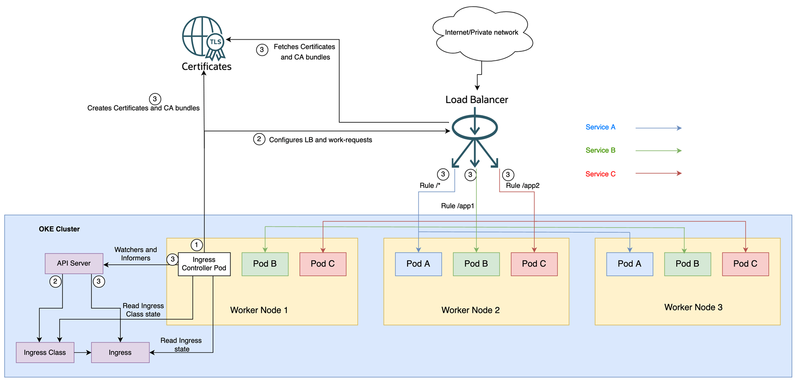

# OCI Native Ingress Controller

Kubernetes Ingress（入口）是一种 Kubernetes 资源，包含路由规则和配置选项的集合，用于处理源自集群外部的 HTTP 和 HTTPS 流量。您可以使用单个Ingress资源来整合多个服务的路由规则，从而避免需要为每个从互联网或网络接收流量的服务创建 LoadBalancer 类型的 Kubernetes 服务（以及关联的 OCI 负载均衡器）

OCI原生入口控制器创建 OCI FLB来处理请求并根据为入口资源定义的规则路由它们。如果路由规则发生变化， OCI原生入口控制器还会更新负载均衡器配置。

为什么选择 原生入口控制器？：

- **直达业务Pod**（不是到Ingress Pod 再转到其他Pod）
- **稳定性更高**（自建Ingress处理流量压力大）
- 支持readiness gates，进一步增加发版稳定性

迁移到OCI NIC的实践：

[从国内云Native Ingress迁移OCI Native Ingress ](%E4%BB%8E%E5%9B%BD%E5%86%85%E4%BA%91Native%20Ingress%E8%BF%81%E7%A7%BBOCI%20Native%20Ingress%2057552d37b1d3419780dadf58fe1f12d1.md)



---

在 Kubernetes 领域，入口控制器是一个关键组件，它允许将传入流量路由到集群内的适当服务。它充当 HTTP 和 HTTPs 流量的入口点，使服务能够向外界公开。虽然 Oracle 中的 Kubernetes 支持多个入口控制器，例如 NGINX Ingress Controller 和 Traefik，但没有控制器与 Oracle 云基础设施 (OCI) 服务集成。

我们很高兴地宣布推出适用于 Kubernetes 的新 OCI 本机入口控制器！借助我们新的本机入口控制器，您现在可以直接在 Kubernetes 内轻松高效地管理入口资源，而无需依赖任何外部控制器。这一尖端解决方案旨在帮助开发人员和企业充分利用云原生应用程序的真正力量，利用 OCI 生态系统实现无缝连接和高级路由功能。

## **什么是 Oracle 云本机入口控制器？**

Oracle 云原生入口控制器是一个强大且可扩展的解决方案，可简化云原生应用程序入站网络流量的管理。它提供了用于路由和负载平衡的集中控制平面，使您能够比以往更轻松、可靠、高效地提供服务。它的设计具有高度可定制性，支持所有最新的入口功能，例如传输层安全 (TLS) 终止、Pod 就绪门、主机和基于路径的路由。它还具有高性能、最小的开销和延迟。

本机入口控制器与充当路由器的 OCI 负载平衡服务无缝集成，OCI 证书管理用于建立 TLS/SSL 通信的证书。

## **好处**

### **简化操作并节省成本**

本机入口控制器使您能够通过在 Kubernetes 集群中的多个应用程序之间共享 OCI 负载均衡器来简化操作并节省成本。您可以为 Oracle Kubernetes 集群中运行的多个服务使用单个负载均衡器，并配置高级路由规则（例如基于路径的路由和基于主机的路由），并将服务整合到单个入口点以实现更低的成本和集中配置。

### **通过 OCI 负载平衡实现即时准备、灵活性和高可用性**

Oracle 负载平衡是一项流行的 Oracle 服务，可在一个区域的多个后端（例如 Oracle 计算实例）的应用程序层（第 7 层）对传入流量进行负载平衡。本机入口控制器与充当路由器的负载均衡器无缝集成，负载均衡器是 Oracle Container Engine for Kubernetes (OKE) 集群外部的独立实体。

OCI 灵活负载平衡使客户能够跨 Pod 队列分发 HTTP(s) 请求，或自动跨故障域、可用性域或区域路由流量，从而为任何应用程序或数据源提供高可用性和容错能力。借助[OCI 灵活负载平衡](https://www.oracle.com/cloud/networking/load-balancing/)，您不再局限于固定带宽负载平衡器形状或仅基于一般流量模式的扩展。您可以选择自定义最小带宽和可选的最大带宽。最小带宽始终可用，并为您的工作负载提供即时准备。如果您需要控制成本，可选的最大带宽设置可以限制带宽，即使在意外峰值期间也是如此。根据传入流量模式，可用带宽随着流量的增加而从最小值开始增加。

### **自动证书管理**

本机入口控制器还与 OCI 证书集成，允许用户创建和管理用于在负载均衡器上启用 HTTPs 流量的 TLS 证书。创建后，本机入口控制器会自动将其关联到负载均衡器，并依赖证书服务自动轮换证书。

### **简化管理和监控**

应用程序部署的高效管理和监控对于保持最佳性能和及时解决问题至关重要。本机入口控制器与 Oracle Cloud Load Balancer 集成，后者具有自己的监控和日志记录功能，可提供对应用程序流量、性能指标和日志的全面可见性。借助集中式 OCI 负载均衡器的监控和管理功能，运营商可以快速识别并解决任何潜在的瓶颈或异常情况，确保流畅、不间断的用户体验。

### **工作节点外部的专用路由资源**

在开源和第三方入口模型中，路由组件是运行在工作节点内的 Pod，它消耗部分专用于应用程序的资源。例如，所有 TLS/SSL 连接都终止于 Kubernetes 集群中运行的入口控制器 Pod。对于大量 HTTP 流量，大量计算浪费在流量的加密和解密上。使用本机入口控制器，此处理发生在负载均衡器级别，从而节省工作节点资源。

### **通过避免额外的跃点来加快响应速度**

以前，Oracle Kubernetes 提供了一个 OCI 负载均衡器，并将工作节点保留为后端，最终路由到您的 Pod。借助本机入口控制器，您的 Pod 可以直接充当 OCI 负载均衡器的后端，避免额外的跃点，而不是依赖内部服务 IP 和 kube-proxy。

## **Oracle 云本机入口控制器如何工作？**

要开始使用我们的本机入口控制器，请将其部署为 Kubernetes 资源，然后像平常一样创建入口资源。我们的控制器会自动创建一个 OCI 负载均衡器，为您处理路由和负载均衡，确保您的流量高效、安全地路由到您的应用程序。

配置[先决条件](https://docs.oracle.com/iaas/Content/ContEng/Tasks/contengsettingupnativeingresscontroller.htm#contengsettingupnativeingresscontroller-prereqs)和所需的身份和访问管理 (IAM) 策略。

[https://blogs.oracle.com/content/published/api/v1.1/assets/CONT32B480717136449CB505E25AABC76C80/native?cb=_cache_83b3&channelToken=f7814d202b7d468686f50574164024ec](https://blogs.oracle.com/content/published/api/v1.1/assets/CONT32B480717136449CB505E25AABC76C80/native?cb=_cache_83b3&channelToken=f7814d202b7d468686f50574164024ec)

创建 OKE 集群或使用现有集群并部署入口控制器。您可以使用 Helm 和 YAML 来部署它。有关详细信息，请参阅[文档](https://docs.oracle.com/iaas/Content/ContEng/Tasks/contengsettingupnativeingresscontroller.htm)。您不需要提及名称空间。如果没有明确提及，入口控制器 Pod 在 native-ingress-controller-system 命名空间中运行。

```bash
$ helm install oci-native-ingress-controller helm/oci-native-ingress-controller
NAME: oci-native-ingress-controller
LAST DEPLOYED: Mon May 15 22:40:18 2023
NAMESPACE: native-ingress-controller-system
STATUS: deployed
REVISION: 1
TEST SUITE: None
$ kubectl get pods -n native-ingress-controller-system -o wide -w
NAME                                             READY   STATUS    RESTARTS   AGE   IP            NODE          NOMINATED NODE   READINESS GATES
oci-native-ingress-controller-6887f9cb9f-m5rg7   1/1     Running   0          10s   10.0.10.148   10.0.10.197   <none>           <none>
```

2.通过Kubernetes API创建多个Kubernetes对象。第一个 IngressClassparameters 是一个自定义资源，其中包含有关隔间 ID、子网 ID、负载均衡器名称和 lb 形状详细信息的详细信息。IngressClassparameters 帮助我们定义 OCI 负载均衡器创建的详细信息。

```
apiVersion: "ingress.oraclecloud.com/v1beta1"
kind: IngressClassParameters
metadata:
     name: ingressparms-prod
     namespace: native -ingress-controller-system
spec:
     loadBalancerName: "native-ic-lb"
     isPrivate: false
     maxBandwidthMbps: 400
     minBandwidthMbps: 100
```

3. 创建一个入口类，该类还会创建一个 OCI 负载均衡器，其形状由 IngressClassparameters 自定义资源指定。如果您在 Kubernetes 集群内运行多个入口控制器实现，则入口类实例有助于将入口资源映射到控制器。如果入口资源有这些要求，它还有助于创建具有不同形状的负载均衡器。

```
apiVersion: networking.k8s.io/v1
kind: IngressClass
metadata:
     name: default -ingress-class
     annotations:
       ingressclass.kubernetes.io/is-default -class :  "true"
spec:
    controller: oci.oraclecloud.com/native -ingress-controller
     parameters:
       scope: Namespace
       namespace: native -ingress-controller-system
       apiGroup: ingress.oraclecloud.com
       kind: ingressclassparameters
       name: ingressparms-prod
```

4. 创建入口资源，指定路由规则。本机入口控制器监视来自 API 服务器的入口更改。当它发现入口资源被创建或更新时，就会启动OCI资源的创建和更新操作。Ingress 将 HTTP 和 HTTPS 路由从集群外部公开到集群内的服务。流量路由由入口资源上定义的规则控制。在以下步骤中，我们在负载均衡器中创建一条路由，以将所有对路径“/app1”的请求重定向到服务 B：

```
apiVersion: networking.k8s.io/v1
kind: Ingress
     metadata:
        name: ingress-tls
        annotations:
          oci-native -ingress.oraclecloud.com/protocol: HTTP
          oci-native -ingress.oraclecloud.com/policy: "ROUND_ROBIN"
          oci-native -ingress.oraclecloud.com/healthcheck-protocol:  "HTTP"
          oci-native -ingress.oraclecloud.com/healthcheck-port:  "9090"
          oci-native -ingress.oraclecloud.com/healthcheck-interval-milliseconds:  "10000"
          oci-native -ingress.oraclecloud.com/healthcheck-timeout-milliseconds:  "3000"
          oci-native -ingress.oraclecloud.com/healthcheck-retries:  "3"
          oci-native -ingress.oraclecloud.com/healthcheck-return -code:  "200"
          oci-native -ingress.oraclecloud.com/healthcheck-response-regex:  ""
          oci-native -ingress.oraclecloud.com/healthcheck-path:  "/health"
          oci-native -ingress.oraclecloud.com/healthcheck-force-plaintext:  "true"
    spec:
        defaultBackend:
          service:
            name: default -backend
            port:
              number: 8080
        tls:
        - hosts:
            - foo.bar.com
          secretName: demo-tls-secret
        rules:
        - host:  "foo.bar.com"
          http:
            paths:
            - pathType: Prefix
              path:  "/app1"
              backend:
                service:
                  name: Service B
                  port:
                    number: 443
```

1. 为入口资源中指定的每个后端创建 OCI 负载均衡器后端集。
2. 为指定为后端服务的每个端口创建侦听器。
3. 为入口资源中指定的每个路径创建路由规则，确保将特定路径的流量路由到创建的正确后端集。
4. 创建 OCI 证书和 CA 捆绑包并将它们与侦听器和后端集关联。如果要在负载均衡器上启用 TLS，请提前创建 Kubernetes 密钥 demo-tls-secret。有关详细说明，请参阅[文档](https://docs.oracle.com/iaas/Content/ContEng/Tasks/contengsettingupnativeingresscontroller.htm)。
5. 创建默认后端集。不匹配任何规则的入口流量将所有流量发送到单个默认后端。创建服务并将其作为默认行为传递到入口。
6. 在服务后端集上配置健康检查。

## **结论**

Oracle 原生入口控制器的推出标志着 Oracle 云原生产品发展过程中的一个重要里程碑。通过简化应用程序部署、增强可扩展性以及与 OCI 服务无缝集成，这款强大的控制器使开发人员和运营商能够高效地交付强大且高性能的应用程序。Oracle 原生入口控制器非常注重安全性、合规性和简化管理，强化了 Oracle 提供全面解决方案的承诺，使组织能够在云原生时代蓬勃发展。

OCI 本机入口控制器是一个可用于生产的开源项目。要了解有关 Oracle 本机入口控制器及其如何转变应用程序部署的更多信息，请查看我们的文档。拥抱 Oracle 云原生生态系统的强大功能，释放应用程序的全部潜力。如果您想参与其中，请参阅以下资源：

- [文档](https://docs.oracle.com/iaas/Content/ContEng/Tasks/contengsettingupnativeingresscontroller.htm)
- [GitHub](https://github.com/oracle/oci-native-ingress-controller)
- [问题](https://github.com/oracle/oci-native-ingress-controller/issues)