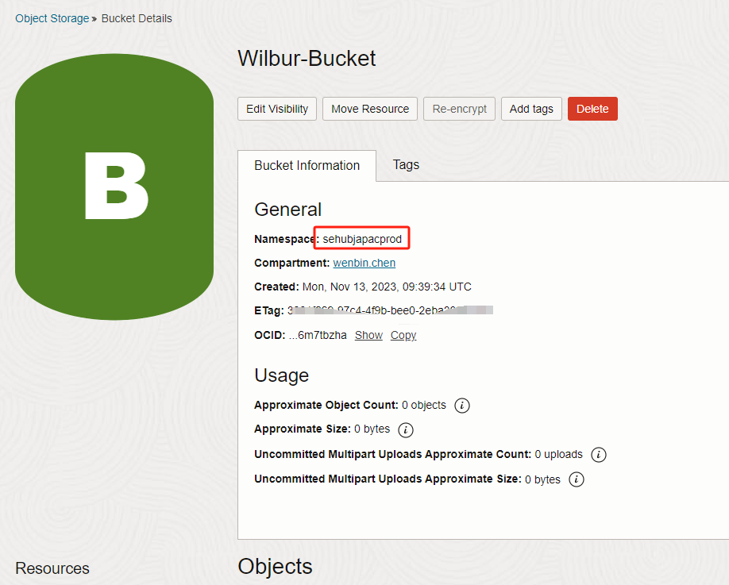

# Velero备份OKE

Velero是一个开源工具，用于安全地备份和恢复、执行灾难恢复以及迁移Kubernetes集群资源和持久卷。

Velero（前身为Heptio Ark）为您提供了备份和恢复Kubernetes集群资源和持久卷的工具。您可以与云提供商一起运行Velero，也可以在本地运行。Velero让您：

- 备份集群并在丢失时进行恢复。
- 将群集资源迁移到其他群集。
- 将生产集群复制到开发和测试集群。

Velero包括：

- 在群集上运行的服务器
- 本地运行的命令行客户端

Velero是一个很好的OKE（K8s）资源备份工具。


## 准备工作

创建一个S3工具用到的Customer Secret Key


## 创建对象存储



s3端点地址规则是：

```
{bucketnamespace}.compat.objectstorage.{region}.oraclecloud.com
```

找到regions

https://docs.oracle.com/en-us/iaas/Content/General/Concepts/regions.htm

所以我的s3 endpoint是

```
sehubjapacprod.compat.objectstorage.us-ashburn-1.oraclecloud.com
```

## 安装

```bash
wget https://github.com/vmware-tanzu/velero/releases/download/v1.12.1/velero-v1.9.0-linux-amd64.tar.gz
tar xzvf velero-v1.9.0-linux-amd64.tar.gz
cd velero-v1.9.0-linux-amd64
vi velero-auth.txt
```

```jsx
[default]
aws_access_key_id=8ac**************50
aws_secret_access_key=97******************aN8=
```

接着执行

```bash
./velero install \
    --provider aws \
    --bucket Wilbur-Bucket \
    --prefix sehubjapacprod \
    --secret-file velero-auth.txt \
--backup-location-config s3Url=https://sehubjapacprod.compat.objectstorage.us-ashburn-1.oraclecloud.com,region=us-ashburn-1,s3ForcePathStyle="true" \
--plugins velero/velero-plugin-for-aws:v1.1.0 \
--use-volume-snapshots=false
```

查看结果

```bash
kubectl logs deployment/velero -n velero
kubectl get pod -n velero
```

## 备份

```bash
kubectl create namespace testing
```

创建一个块存储，以及一个共享存储，这2个存储仅用于测试

```yaml
kind: StorageClass
apiVersion: storage.k8s.io/v1
metadata:
  name: oci-fss1
provisioner: oracle.com/oci-fss
parameters:
  # Insert mount target from the FSS here
  mntTargetId: ocid1.mounttarget.oc1.us_ashburn_1.aaaaaa4np2sra5lqmjxw2llqojxwiotboaww25lxxxxxxxxxxxxxiljr
---
apiVersion: v1
kind: PersistentVolume
metadata:
 name: oke-fsspv1
spec:
 storageClassName: oci-fss1
 capacity:
  storage: 100Gi
 accessModes:
  - ReadWriteMany
 mountOptions:
  - nosuid
 nfs:
# Replace this with the IP of your FSS file system in OCI
  server: 10.0.0.3
# Replace this with the Path of your FSS file system in OCI
  path: /testpv
  readOnly: false
---
apiVersion: v1
kind: PersistentVolumeClaim
metadata:
 name: oke-fsspvc1
spec:
 storageClassName: oci-fss1
 accessModes:
 - ReadWriteMany
 resources:
  requests:
    storage: 100Gi
 volumeName: oke-fsspv1
```

```yaml
apiVersion: v1
kind: PersistentVolume
metadata:
  name: cwb-pv
spec:
  capacity:
    storage: 50Gi
  volumeMode: Filesystem
  accessModes:
    - ReadWriteMany
  persistentVolumeReclaimPolicy: Retain
  csi:
    driver: fss.csi.oraclecloud.com
    volumeHandle: ocid1.filesystem.oc1.iad.aaaaaaaaaafn7y6oxxxxxxxxxxxxxxxxxxxxxxxxxxzaaaaa:10.0.10.70:/Centos1
---
apiVersion: v1
kind: PersistentVolumeClaim
metadata:
  name: cwb-pvc-1
spec:
  accessModes:
    - ReadWriteMany
  storageClassName: ""
  resources:
    requests:
      storage: 50Gi
  volumeName: cwb-pv
---
apiVersion: apps/v1
kind: Deployment
metadata:
  name: centos
  annotations: 
    
spec:
  selector:
    matchLabels:
      app: centos
  replicas: 2
  template:
    metadata:
      labels:
        app: centos
    spec:
      containers:
      - name: centos
        image: centos:7
        command:
          - sleep
          - "3600"
        imagePullPolicy: IfNotPresent
        volumeMounts:
          - name: persistent-storage
            mountPath: /home/test
            subPath: kj
      securityContext:
        runAsUser: 0
        fsGroup: 0
      volumes:
      - name: persistent-storage
        persistentVolumeClaim:
          claimName: cwb-pvc-1
```

```bash
kubectl annotate pod/oke-fsspod3 backup.velero.io/backup-volumes=oke-fsspv1

./velero backup create test11 --include-namespaces default --wait
```

进到对象存储，可以看到里面会有一些备份文件，但不会有块存储及共享存储内容（块存储需要用另外的机制备份）

## 恢复

待续

## 删除Velero（备用）

如果做错了，则删除重来一遍。

```bash
kubectl delete namespace/velero clusterrolebinding/velero
kubectl delete crds -l component=velero
```