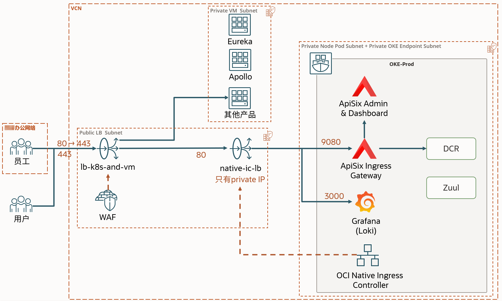
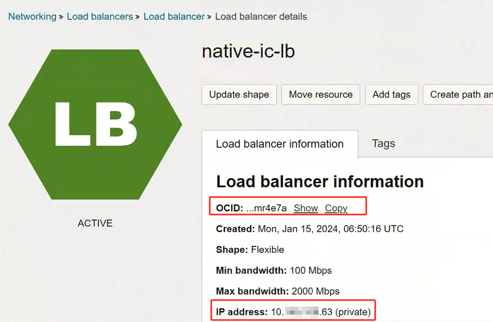
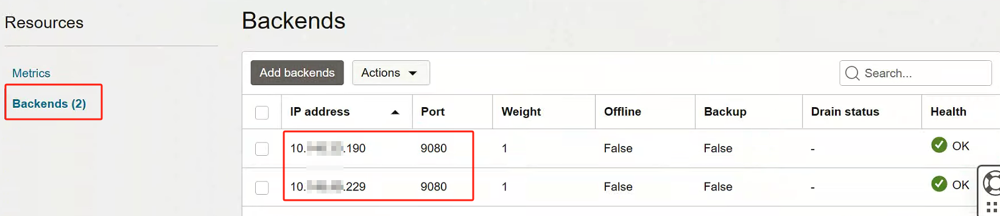
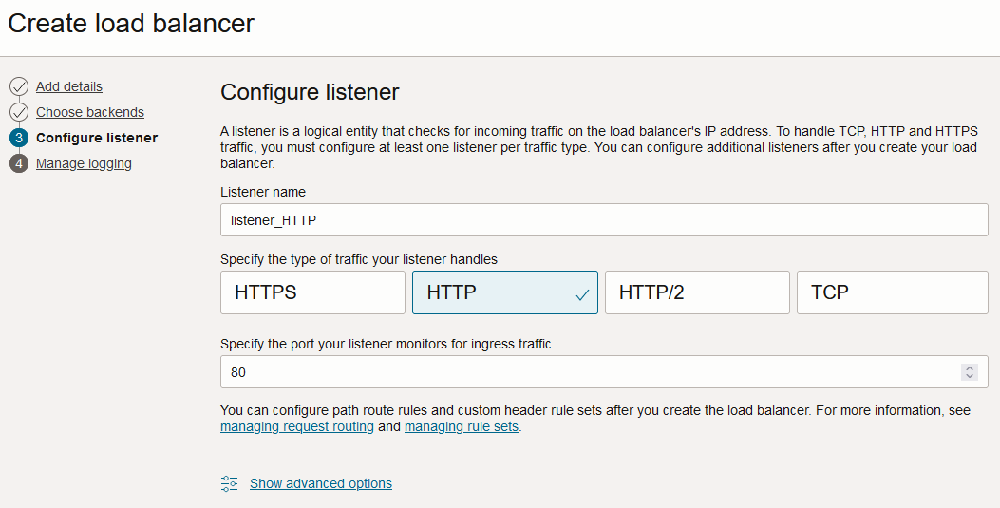
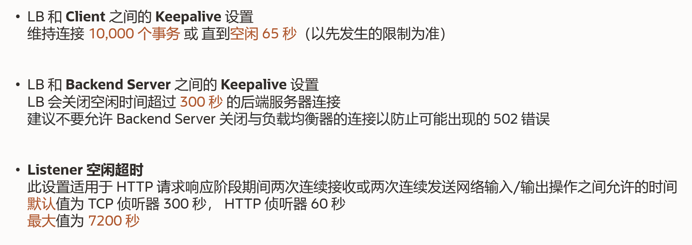

# 从国内云Native Ingress迁移OCI Native Ingress

Kubernetes Ingress（入口）是一种 Kubernetes 资源，包含路由规则和配置选项的集合，用于处理源自集群外部的 HTTP 和 HTTPS 流量。您可以使用单个Ingress资源来整合多个服务的路由规则，从而避免需要为每个从互联网或网络接收流量的服务创建 LoadBalancer 类型的 Kubernetes 服务（以及关联的 OCI 负载均衡器）

OCI原生入口控制器创建 OCI FLB来处理请求并根据为入口资源定义的规则路由它们。如果路由规则发生变化， OCI原生入口控制器还会更新负载均衡器配置。

为什么选择 原生入口控制器？：

- **直达业务Pod**（不是到Ingress Pod 再转到其他Pod）
- **稳定性更高**（自建Ingress处理流量压力大）
- 支持readiness gates，进一步增加发版稳定性


---

## 1.简介

相比于常规Ingress的流量链路 LB –> Ingress Pods –> Workload Pods相比， Native Ingress Controller 可以简化流量链路： LB –> Workload Pods 。原理就是把OCI的LB作为Ingress的一部分。

我们将使用Native Ingress Controller构建以下方案：



如果有需要，可以更换自建的WAF：


这是根据当前情况设计的方案，我们还有其他很多方案供选择及调整，如需有需要请联系甲骨文支持团队。

## 2.权限配置

### 2.1 开发环境简易授权方案

创建动态组

```
ALL {instance.compartment.id = 'ocid1.tenancy.oc1..xxxxxxxxxxxx'}
```

授权，创建策略 acme-oke-native-ingress-controller-policy

```
Allow dynamic-group acme-oke-native-ingress-controller-dyn-grp to manage load-balancers in tenancy
Allow dynamic-group acme-oke-native-ingress-controller-dyn-grp to use virtual-network-family in tenancy
Allow dynamic-group acme-oke-native-ingress-controller-dyn-grp to manage cabundles in tenancy
Allow dynamic-group acme-oke-native-ingress-controller-dyn-grp to manage cabundle-associations in tenancy
Allow dynamic-group acme-oke-native-ingress-controller-dyn-grp to manage leaf-certificates in tenancy
Allow dynamic-group acme-oke-native-ingress-controller-dyn-grp to read leaf-certificate-bundles in tenancy
Allow dynamic-group acme-oke-native-ingress-controller-dyn-grp to manage certificate-associations in tenancy
Allow dynamic-group acme-oke-native-ingress-controller-dyn-grp to read certificate-authorities in tenancy
Allow dynamic-group acme-oke-native-ingress-controller-dyn-grp to manage certificate-authority-associations in tenancy
Allow dynamic-group acme-oke-native-ingress-controller-dyn-grp to read certificate-authority-bundles in tenancy
Allow dynamic-group acme-oke-native-ingress-controller-dyn-grp to read cluster-family in tenancy
```

### 2.2 生产环境精准授权方案

使用workload identityprincipals方案，让指定的Pod才有权限控制VCN云虚拟网络。
先创建一个Policy，需要你手工替换为你的OKE的OCID后再授权：

```
Allow any-user to manage load-balancers in <location> where all {request.principal.type = 'workload', request.principal.namespace = 'native-ingress-controller-system', request.principal.service_account = 'oci-native-ingress-controller', request.principal.cluster_id = '<cluster-ocid>'}
Allow any-user to use virtual-network-family in <location> where all {request.principal.type = 'workload', request.principal.namespace = 'native-ingress-controller-system', request.principal.service_account = 'oci-native-ingress-controller', request.principal.cluster_id = '<cluster-ocid>'}
Allow any-user to manage cabundles in <location> where all {request.principal.type = 'workload', request.principal.namespace = 'native-ingress-controller-system', request.principal.service_account = 'oci-native-ingress-controller', request.principal.cluster_id = '<cluster-ocid>'}
Allow any-user to manage cabundle-associations in <location> where all {request.principal.type = 'workload', request.principal.namespace = 'native-ingress-controller-system', request.principal.service_account = 'oci-native-ingress-controller', request.principal.cluster_id = '<cluster-ocid>'}
Allow any-user to manage leaf-certificates in <location> where all {request.principal.type = 'workload', request.principal.namespace = 'native-ingress-controller-system', request.principal.service_account = 'oci-native-ingress-controller', request.principal.cluster_id = '<cluster-ocid>'}
Allow any-user to read leaf-certificate-bundles in <location> where all {request.principal.type = 'workload', request.principal.namespace = 'native-ingress-controller-system', request.principal.service_account = 'oci-native-ingress-controller', request.principal.cluster_id = '<cluster-ocid>'}
Allow any-user to manage certificate-associations in <location> where all {request.principal.type = 'workload', request.principal.namespace = 'native-ingress-controller-system', request.principal.service_account = 'oci-native-ingress-controller', request.principal.cluster_id = '<cluster-ocid>'}
Allow any-user to read certificate-authorities in <location> where all {request.principal.type = 'workload', request.principal.namespace = 'native-ingress-controller-system', request.principal.service_account = 'oci-native-ingress-controller', request.principal.cluster_id = '<cluster-ocid>'}
Allow any-user to manage certificate-authority-associations in <location> where all {request.principal.type = 'workload', request.principal.namespace = 'native-ingress-controller-system', request.principal.service_account = 'oci-native-ingress-controller', request.principal.cluster_id = '<cluster-ocid>'}
Allow any-user to read certificate-authority-bundles in <location> where all {request.principal.type = 'workload', request.principal.namespace = 'native-ingress-controller-system', request.principal.service_account = 'oci-native-ingress-controller', request.principal.cluster_id = '<cluster-ocid>'}
Allow any-user to read cluster-family in <location> where all {request.principal.type = 'workload', request.principal.namespace = 'native-ingress-controller-system', request.principal.service_account = 'oci-native-ingress-controller', request.principal.cluster_id = '<cluster-ocid>'}
```

## 3.新建 Native Ingress


### 3.1 安装Native Ingress
Controller

```
git clone https://github.com/oracle/oci-native-ingress-controller
vim oci-native-ingress-controller/helm/oci-native-ingress-controller/values.yaml
```

生产环境修改以下值：

```yaml
compartment_id: "ocid1.compartment.oc1..xxxxxxxxx"
subnet_id: "ocid1.subnet.oc1.ap-mumbai-1.xxxxxxxxxxxxx"
cluster_id: "ocid1.cluster.oc1.ap-mumbai-1.xxxxxxxxxxxxx"
authType: workloadIdentity
replicaCount: 3
```

生产环境的workloadIdentity授权方式还需要修改环境变量：

```
vi oci-native-ingress-controller/helm/oci-native-ingress-controller/templates/deployment.yaml
```

添加环境变量

```
  env:
    - name: OCI_RESOURCE_PRINCIPAL_VERSION
      value: "2.2"
    - name: OCI_RESOURCE_PRINCIPAL_REGION
      value: "ap-mumbai-1"
```

安装OCI Native Ingress Controller：

```
helm install oci-native-ingress-controller oci-native-ingress-controller/helm/oci-native-ingress-controller
kubectl get pods -n native-ingress-controller-system --selector='app.kubernetes.io/name in (oci-native-ingress-controller)' -o wide
```

### 3.2 创建 Native Ingress Class

定义K8s IngressClass相关资源ingressClass.yaml：

```yaml
apiVersion: "ingress.oraclecloud.com/v1beta1"
kind: IngressClassParameters
metadata:
  name: native-ic-params
  namespace: kube-system
spec:
  compartmentId: "ocid1.compartment.oc1..xxxxxxxxxxxxxxxxx"
  subnetId: "ocid1.subnet.oc1.ap-mumbai-1.xxxxxxxxxxxxxxxxxxxxxxxxx"
  loadBalancerName: "native-ic-lb"
  isPrivate: true
  # 带宽跟之前的生产环境一致，2000Mbps。 这里为浮动带宽，按实际流量计费（但计费不会低于最小带宽）
  maxBandwidthMbps: 2000
  minBandwidthMbps: 100
---
apiVersion: networking.k8s.io/v1
kind: IngressClass
metadata:
  name: native-ic-ingress-class
  annotations:
    ingressclass.kubernetes.io/is-default-class: "false"
spec:
  controller: oci.oraclecloud.com/native-ingress-controller
  parameters:
    scope: Namespace
    namespace: kube-system
    apiGroup: ingress.oraclecloud.com
    kind: ingressclassparameters
    name: native-ic-params
```

应用：

```
kubectl apply -f ingressClass.yaml
```

稍等一会儿，等LB创建好后可以看到IP，后续验证Ingress的时候用到：



### 3.3 创建Ingress（对应LB的Listener + BackendSet)

定义Ingress资源：

```yaml
apiVersion: networking.k8s.io/v1
kind: Ingress
metadata:
  name: ops-ingress-grafana
  namespace: grafana
  #annotations:
    # 健康检测端口,可以不填
    # oci-native-ingress.oraclecloud.com/healthcheck-port: "3000"
spec:
  ingressClassName: native-ic-ingress-class
  rules:
  # apisix-admin
  - host: "grafana-xxxx.xxxxx.com"
    http:
      paths:
        - pathType: Prefix
          path: /
          backend:
              service:
                name: grafana
                port:
                  number: 80
---
apiVersion: networking.k8s.io/v1
kind: Ingress
metadata:
  name: ops-ingress-apisix
  namespace: apisix
  #annotations:
    # 健康检测端口,可以不填
    # oci-native-ingress.oraclecloud.com/healthcheck-port: "9080"
spec:
  ingressClassName: native-ic-ingress-class
  rules:
  # apisix-gateway 公内网域名
  - host: "hostname1.com"
    http:
      paths:
        - pathType: Prefix
          path: /
          backend:
              service:
                name: apisix-gateway
                port:
                  number: 80
  # apisix-gateway 内网域名
  - host: "hostname2.com"
    http:
      paths:
        - pathType: Prefix
          path: /
          backend:
              service:
                name: apisix-gateway
                port:
                  number: 80
  # apisix-admin 管理平台
  - host: "hostname3.com"
    http:
      paths:
        - pathType: Prefix
          path: /
          backend:
              service:
                name: apisix-gateway
                port:
                  number: 80
#  默认规则
  defaultBackend:
    service:
      name: apisix-gateway
      port:
        number: 9080
```

**如果需要把默认的所有域名都转到apisix-gateway，记得把最后几张的defaultBackend注释删掉。**

创建资源：

```
kubectl apply -f ingress.yaml
```

### 3.4 查看成果

此时，Native Ingress Controller 已经创建了80端口的侦听器（Listener）,路由策略（Routing Policies）以及包含通向所有APISix Pod 端口的BackendSet。

先来看看Listener监听器，监听80的HTTP端口，默认后端集是default_ingress，路由策略名叫route_80：


打开路由策略


可以看到分发规则与ingress.yaml文件中的host和path意义对应，并声明了符合规则的流量转发到哪个Backendset中


最后来看看后端集：


image-20240123170512354

点进去，先看看健康检测端口。如果yaml中声明了健康检测端口，则显示与yaml文件一致，否则这里是0：


image-20240123170815548


再到下方看看backends



跟K8s中的Pod
IP一致，说明LB直达业务Pod（这里的业务Pod就是ApiSix的Pod）：


```
kubectl describe svc apisix-gateway -n apisix
```


## 4. 创建第2个LB


### 4.1创建LB

如果需要Web应用防火墙（WAF），可以在创建LB前先把WAF先建好（见后续步骤），这样可以在创建LB时顺便关联WAF。
或者先建LB，然后建WAF的时候顺便关联LB。


填写名称，选公共网络。

<aside>
💡 **注意，这里可以选预留的IP地址**。选择预留IP后，如果不小心删除LB，再重建LB时，公网IP就变了。

</aside>


选择带宽大小（按需，建议跟原来生产环境保持一致，最小100Mbps，最大2000Mbps），网络选OKE所在网络，子网选为OKE创建的子网（或单独创建一个新的）。


（可选，如无必要请跳过）创建的时候可以关联WAF。


建一个HTTP监听器:



建议打开日志，有助于分析问题：


创建成功后，得到公网IP，这个公网IP可以用于DNS解析：


### 4.2 编辑通往Ingress LB的后端集

进入默认的后端集


添加后端，把Ingress LB的内网IP填进去：


### 4.3 调整安全策略

找到子网，点进去


添加出口策略，运行访问外部的80端口。


image-20231224150058306

## 5. 配置HTTPS侦听器

下面将用我自己的域名举例

### 5.1 创建域名

先创建Hostname，**注意，这里是可以使用通配符的，比如*.oracle.com**.**

<aside>
💡 **使用通配符可以有效减少配置数量（**需要配合通配符证书，因为一个监听器只能配1个证书**）。

</aside>


image-20231221131734710

添加证书，注意，证书资源类型选
**LB自管理证书**，可以有效减少配置步骤：


### 5.2 创建证书

我用了阿里云生成的证书，下的是Apache的证书文件：


### 5.3 创建侦听器

创建LB的时候已经监听了80端口，只需手工添加https的443端口监听（每个证书添加一个监听）


image-20231224154125635

协议选HTTPS，选择域名（可多选）及证书（**单证书**），


多个Listener可以用同一个域名（但是端口不能一样）。也可以创建一个无域名的Listener，用于匹配其他所有域名。

### 5.4 使用路由策略分发流量（可选，默认情况下不需要此步骤）

先照抄Ingress LB的策略，也可以适当简化。


image-20231224162940245

让Listener使用刚创建的Routing Policy来分发流量：


## 6. HTTP跳转到HTTPS


先创建一个规则集：


把规则关联到Listener：


等一会让配置生效，试试效果：


## 7. 从LB分发流量到虚拟机

当要将流量发送给非K8s Work Node的其他VM时。

我们需要新建一个BackendSet ，并为HTTPS Listener新建一个Route Policy
(把Ingress自动创建的Route Policy规则照抄过来，再跳转到VM的规则)。

或者简单一点，在Listener中把直接用域名分发。


### 7.1 创建VM后端集

为虚拟机建一个后端集


协议可以选TCP或HTTP。如果是HTTP可以判断返回的内容


创建好后点进去，添加后端：


可以勾选现有的VM，也可以手工填写IP地址（只要是IP就可以，不限定是公网IP还是内网IP，也不限定IP是否被真实被VM使用到了）


### 7.2 方案一：使用Listener
Hostname分发

创建一个新域名及证书，见“配置HTTPS侦听器”

再创建一个新的Listener，使用VM新域名：


### 7.3 方案二：使用LB路由分发


再添加到VM的规则


然后模仿Ingress LB的Route policy与Listener配置好HTTPS 和 HTTP2个Listener。

## 8. 配置OCI WAF（Web应用防火墙）

按需执行本步骤。

如果仅仅因为需要IP白名单，VCN的Security已经能满足要求。结合实际场景，调整为以下架构后可以不再需要白名单：


但如果需要限流、防止SQL注入等高级功能，则需要添加一个WAF：


### 8.1 创建WAF 并关联到 LB

先建一个Web应用防火墙


很多步骤都默认即可，也可以按需配置


关联上Native Ingress 的 LB .


**或者**等WAF创建好后，把WAF的ID放到Ingress.yaml的注解中，然后重新kubectl apply一下**(上面关联过后就不用这一步了)**：

```yaml
oci-native-ingress.oraclecloud.com/waf-policy-ocid: ocid1.webappfirewallpolicy.oc1.iad.xxxxxxxxxxx
```


关联方法3：创建LB的时候关联已经存在的WAF


### 8.2 不符合规则的返回HTTP 503错误信息

先创建一个504的动作


返回的503网页正文Demo如下：

```
<!DOCTYPE html>
<html>
<head>
    <meta charset="UTF-8">
    <title>503 服务暂时不可用</title>
    <style>
        body {
            font-family: Arial, sans-serif;
            text-align: center;
            background-color: #f0f0f0;
        }
        h1 {
            color: #333;
        }
    </style>
</head>
<body>
    <h1>503 服务暂时不可用</h1>
    <p>您请求的服务暂时不可用（请通过指定网络访问）。请稍后再试。</p>
</body>
</html>
```

### 8.3 WAF访问规则

作为案例，我们设置3条访问规则：

- 默认返回503页面
- 允许来自内网（含云的NAT网关公网IP，企业办公室的公网IP，企业VPN的公网IP)
- 允许域名是 xxx.xxx.com这个C端客户访问的公共网站流量

接下来开始配置，先创建一条访问控制：


默认返回返回503的配置方法：


企业内网的源IP范围如下（填入上图中的Source IP address中）：

```
10.1.0.0/16
10.2.0.0/16
...等等
```

或

```
10.0.0.8/8
```

接下来再创建一条规则，允许域名是xxxx.xxxx.om的请求（公网域名）


已经配置成功，接下来试试看效果吧

## 9. 配置自建WAF

如果公司有自己的WAF程序，可以将自己的WAF应用部署到虚拟机中，并将其放到2个LB之间，架构改动如下：


另外还需要将第一个LB（lb-k8s-and-vm)的后端改成WAF集群的每个实例的IP和端口。

## 10. 如何找到公网LB的内网IP

如果FLB被创建为一个具有公网IP的LB，那这个LB也会有1主1备内网IP，可以通过监控检测的日志找到


上图圈起来的就是LB的内网IP。除此之外也可以使用FLB的公网IP。虽然是公网IP，但是流量不会走出IDC机房。

## 11. 后端长连接

在Client –> LB Listener –> Backend (Pod) 这个链路中 LB –>Backend (Pod) 已经默认配置了Keepalive的。

Client –> LB Listener 的链路中，对每个Client有1万个事务，容量非常大。



另外Listener可以配置空闲超时时间。


## 12. Nginx配置(测试用)

nginx配置

```
server {
    listen       80;
    listen  [::]:80;
    server_name  test1.oracle.fit;

    location / {
        root   /usr/share/nginx/test1.oracle.fit;
        index  index.html index.htm;
    }
}

server {
    listen       80;
    listen  [::]:80;
    server_name  test1.oracle-work.com;

    location / {
        root   /usr/share/nginx/test1.oracle-work.com;
        index  index.html index.htm;
    }
}

```

生成configMap

```bash
kubectl create configmap nginx-fit1 --from-file=nginx/test1.oracle.fit/index.html
kubectl create configmap nginx-work1 --from-file=nginx/test1.oracle-work.com/index.html
kubectl create configmap nginx-sites --from-file=nginx/sites.conf
```

Nginx的K8s资源定义

```yaml
apiVersion: apps/v1
kind: Deployment
metadata:
  name: nginx
spec:
  selector:
    matchLabels:
      app: nginx
  replicas: 1
  template:
    metadata:
      labels:
        app: nginx
    spec:
      #readinessGates:
      #- conditionType: backend-health.lb.ingress.k8s.oci/nginx_80
      containers:
      - name: nginx
        image: nginx
        imagePullPolicy: IfNotPresent
        resources:
          requests:
            memory: "128Mi"
          limits:
            memory: "512Mi"
        ports:
        - containerPort: 80
        - containerPort: 443
        volumeMounts:
        - name: nginx-sites
          mountPath: /etc/nginx/conf.d/sites.conf
          subPath: sites.conf
        - name: nginx-fit1
          mountPath: /usr/share/nginx/test1.oracle.fit/index.html
          subPath: index.html
        - name: nginx-work1
          mountPath: /usr/share/nginx/test1.oracle-work.com/index.html
          subPath: index.html
      volumes:
        - name: nginx-sites
          configMap:
            name: nginx-sites
        - name: nginx-fit1
          configMap:
            name: nginx-fit1
        - name: nginx-work1
          configMap:
            name: nginx-work1
---
apiVersion: v1
kind: Service
metadata:
  name: nginx
  labels:
    name: nginx
spec:
  ports:
    - port: 80
      targetPort: 80
      name: nginx-http
    - port: 443
      targetPort: 443
      name: nginx-https
  type: ClusterIP
  selector:
    app: nginx

```

## 13. 相关资料

- Native Ingress Controller 的OCI文档：https://docs.oracle.com/en-us/iaas/Content/ContEng/Tasks/contengsettingupnativeingresscontroller.htm
- 同上，不过是Github上的版本：https://github.com/oracle/oci-native-ingress-controller/blob/main/GettingStarted.md
- Native Ingress Controller 开源仓库：https://github.com/oracle/oci-native-ingress-controller
- Blog：https://blogs.oracle.com/cloud-infrastructure/post/oracle-cloud-native-ingress-controller-kubernetes
- Load Balancer的OCI文档：https://docs.oracle.com/en-us/iaas/Content/Balance/home.htmk