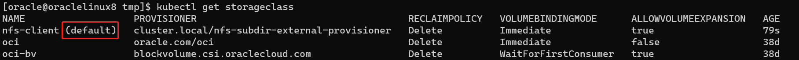
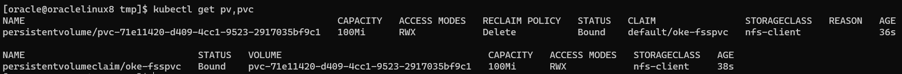

[返回OKE中文文档集](../README.md)

# 在OKE上创建基于FileStorage(NFS)的StorageClass

1. 在OCI上创建File Systems和设置VCN安全规则，参考文档，

   - [Creating File Systems (oracle.com)](https://docs.oracle.com/en-us/iaas/Content/File/Tasks/creatingfilesystems.htm)
   - [Configuring VCN Security Rules for File Storage (oracle.com)](https://docs.oracle.com/en-us/iaas/Content/File/Tasks/securitylistsfilestorage.htm#Configuring_VCN_Security_Rules_for_File_Storage)

2. 安装`nfs-subdir-external-provisioner`，请将nfs.server和nfs.path改为自己的环境信息。
   ```
   helm repo add nfs-subdir-external-provisioner https://kubernetes-sigs.github.io/nfs-subdir-external-provisioner/
   helm repo update
   ```

   ```
   kubectl create namespace nfs-provisioner
   helm install -n nfs-provisioner nfs-subdir-external-provisioner nfs-subdir-external-provisioner/nfs-subdir-external-provisioner \
       --set nfs.server=xxx.xxx.xxx.xxx \
       --set nfs.path=<YOUR_NFS_PATH>
   ```

   确认，
   ```
   kubectl get storageclass
   ```

3. (Optional)将`nfs-client`设置为默认StorageClass，

   ```
   kubectl patch storageclass oci -p '{"metadata": {"annotations":{"storageclass.kubernetes.io/is-default-class":"false"}}}'
   kubectl patch storageclass oci -p '{"metadata": {"annotations":{"storageclass.beta.kubernetes.io/is-default-class":"false"}}}'
   kubectl patch storageclass oci-bv -p '{"metadata": {"annotations":{"storageclass.kubernetes.io/is-default-class":"false"}}}'
   kubectl patch storageclass oci-bv -p '{"metadata": {"annotations":{"storageclass.beta.kubernetes.io/is-default-class":"false"}}}'
   kubectl patch storageclass nfs-client -p '{"metadata": {"annotations":{"storageclass.kubernetes.io/is-default-class":"true"}}}'
   kubectl patch storageclass nfs-client -p '{"metadata": {"annotations":{"storageclass.beta.kubernetes.io/is-default-class":"true"}}}'
   ```

   确认，

   ```
   kubectl get storageclass
   ```

   nfs-client是默认(default)的StorageClass，

   

4. (Optional)创建pvc和pod进行测试
   ```
   cat <<EOF | kubectl apply -f -
   apiVersion: v1
   kind: PersistentVolumeClaim
   metadata:
     name: oke-fsspvc
   spec:
     storageClassName: "nfs-client"
     accessModes:
       - ReadWriteMany
     resources:
       requests:
         storage: 100Mi
   ---
   apiVersion: v1
   kind: Pod
   metadata:
     name: oke-fsspod
   spec:
     containers:
     - name: web
       image: nginx
       volumeMounts:
        - name: nfs
          mountPath: "/usr/share/nginx/html/"
       ports:
         - containerPort: 80
           name: http
     volumes:
     - name: nfs
       persistentVolumeClaim:
         claimName: oke-fsspvc
         readOnly: false
   EOF
   ```

   确认，

   ```
   kubectl get pv,pvc
   ```

   pv和pvc的状态都是Bound，

   

5. (Optional)卸载nfs-subdir-external-provisioner，

   ```
   helm uninstall -n nfs-provisioner nfs-subdir-external-provisioner
   ```

   

参考文档：

- [Creating File Systems (oracle.com)](https://docs.oracle.com/en-us/iaas/Content/File/Tasks/creatingfilesystems.htm)

- [Configuring VCN Security Rules for File Storage (oracle.com)](https://docs.oracle.com/en-us/iaas/Content/File/Tasks/securitylistsfilestorage.htm#Configuring_VCN_Security_Rules_for_File_Storage)[](https://docs.oracle.com/en-us/iaas/Content/File/Tasks/securitylistsfilestorage.htm#Configuring_VCN_Security_Rules_for_File_Storage)

  

[返回OKE中文文档集](../README.md)