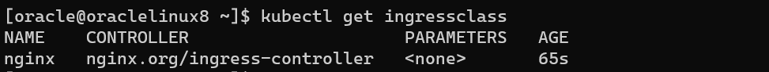

[返回OKE中文文档集](../README.md)

# 在OKE上安装NGINXIngressController

1. 添加Helm库

   ```
   helm repo add nginx-stable https://helm.nginx.com/stable
   helm repo update
   ```

2. 安装NGINX Ingress Controller，

   ```
   kubectl create namespace nginx-ingress
   helm install -n nginx-ingress nginx-ingress nginx-stable/nginx-ingress
   ```

   (Optional)如果想启用设置Snippets功能

   ```
   helm install -n nginx-ingress nginx-ingress --set controller.enableSnippets=true nginx-stable/nginx-ingress
   ```

3. 确认是否创建了新的ingressclass，

   ```
   kubectl get ingressclass
   ```

   输出结果，

   

4. (Optional)卸载NGINX Ingress Controller，

   ```
   helm uninstall -n nginx-ingress nginx-ingress
   ```

   

参考文档：

- [Installation with Helm | NGINX Ingress Controller](https://docs.nginx.com/nginx-ingress-controller/installation/installation-with-helm/)


[返回OKE中文文档集](../README.md)

