# 在OKE上部署ERDA


## 创建OCI资源

##### Step 1.  创建OKE及VCN 

为了方便测试，我们使用快速方式创建一个公网OKE和公网Node：

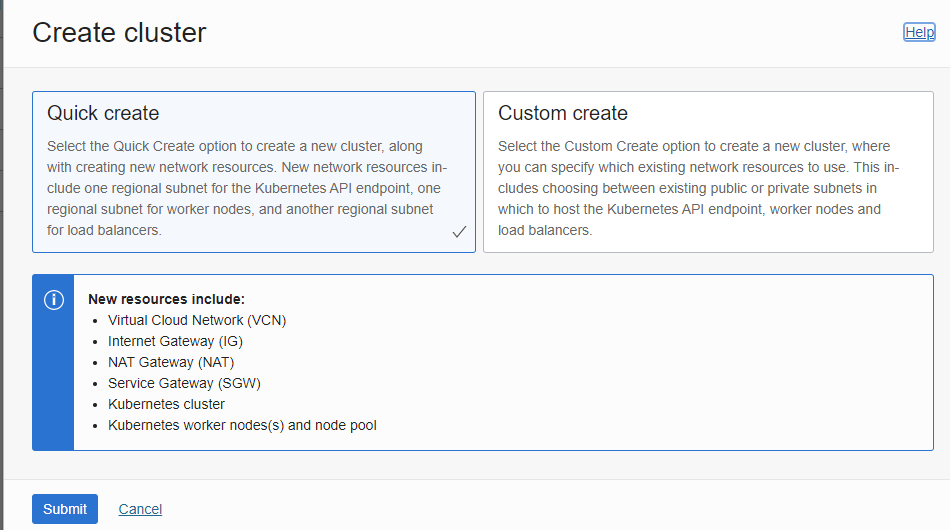

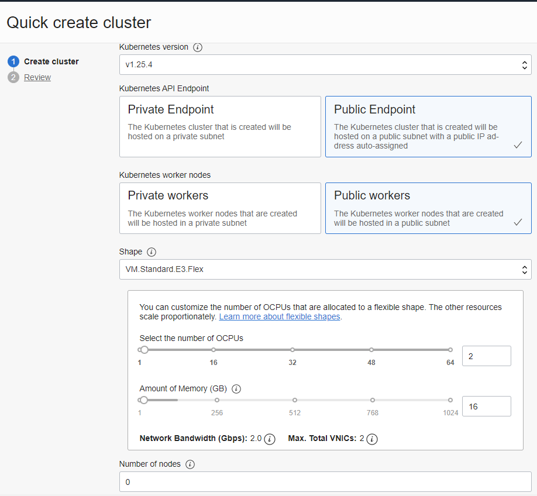

在上图中，先把节点数量置为0，因为下面我们需要定制启动盘大小，后续(Step 2)还需要更新配置，把一个自动扩容磁盘的脚本加上，加上后才扩大节点到2台(Step 3)。

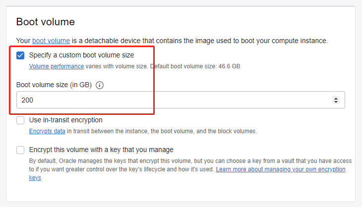

上传虚拟机私钥，等会要登录到WorkNode中修改配置

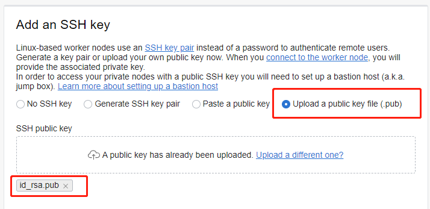

点击创建，等待完成：

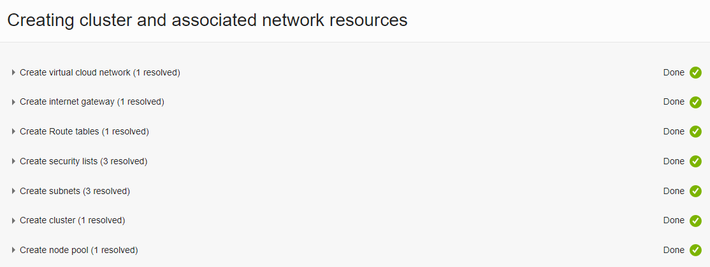

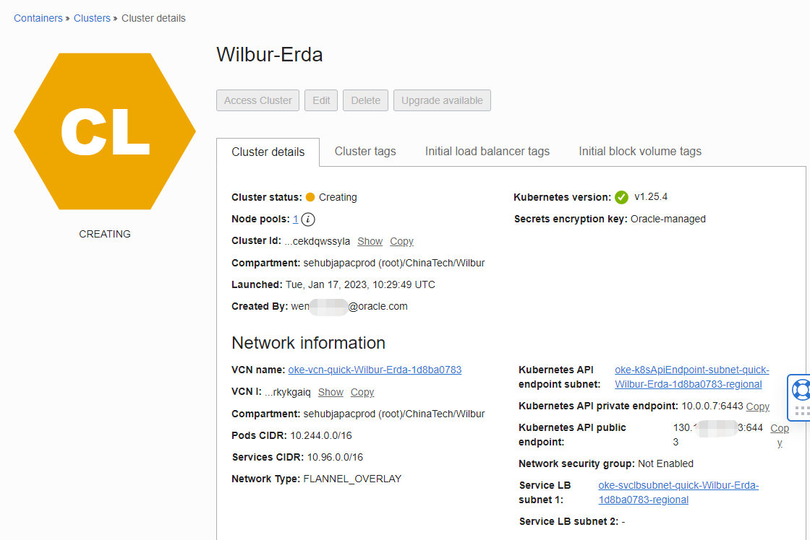


##### Step 2. 创建NFS共享存储

点击菜单 **Storage => File System**，在界面中点击**Create File System**按钮，创建一个共享文件系统。这里，我将文件系统的名字和挂载点的名字改得更具有可读性，并让挂载点网络位于Node所在网络。

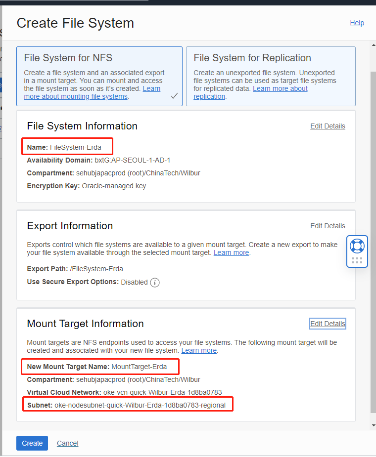


得到一个挂载点( 但这里先不挂载，我们会是Step 4中用初始化脚本统一挂载)

```shell
sudo mkdir /netdata
sudo mount -o nosuid,resvport 10.0.10.191:/FileSystem-Erda /netdata
sudo sh -c 'echo "10.0.10.191:/FileSystem-Erda /netdata nfs deafults,nosuid,resvport 0 0" >> /etc/fstab'
```


如果已经有Node子网内所有协议已放行，请忽略下面的步骤：（10.0.10.0/24 All Protocals）：

在挂载前，需要先开通网络访问策略，进入 **Networking => Virtual Cloud Networks => oke-Node所在VCN  vcn-quick-Wilbur-Erda-1d8ba0783 => Node所在子网 oke-nodesubnet-quick-Wilbur-Erda-1d8ba0783-regional => Node所用安全列表 oke-nodeseclist-quick-Wilbur-Erda-1d8ba0783** 。新增以下4条Ingress规则（我的NFS和Node都在10.0.10.0/24子网）：


##### Step 2. 添加磁盘扩容的初始化脚本 

等待创建完成后，在 **Containers  => Clusters => Cluster details => Node pools** 中，编辑**pool1**

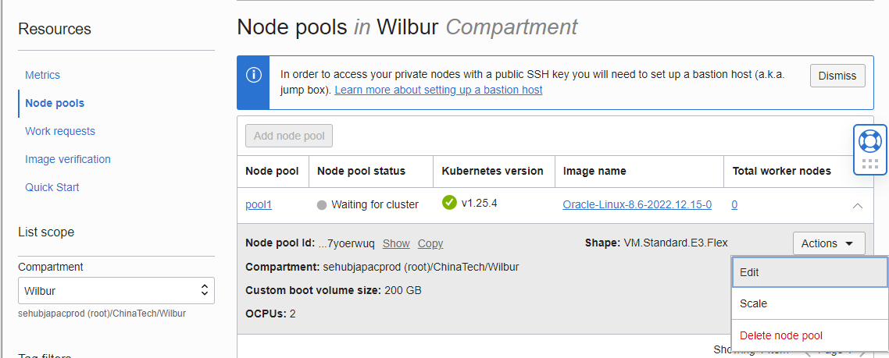

找到隐藏的高级选型中的初始化脚本， 填入（**记得更换Mount Target的IP**）

```shell
#!/bin/bash
curl --fail -H "Authorization: Bearer Oracle" -L0 http://169.254.169.254/opc/v2/instance/metadata/oke_init_script | base64 --decode >/var/run/oke-init.sh
bash /var/run/oke-init.sh

sudo dd iflag=direct if=/dev/sda of=/dev/null count=1
echo "1" | sudo tee /sys/class/block/sda/device/rescan
echo "y" | sudo /usr/libexec/oci-growfs


sudo mkdir /netdata
#把下面的IP换成你的Mount Target显示的IP
sudo mount -o nosuid,resvport 10.0.10.191:/FileSystem-Erda /netdata
sudo sh -c 'echo "10.0.10.191:/FileSystem-Erda /netdata nfs deafults,nosuid,resvport 0 0" >> /etc/fstab'
sudo mount -a
```

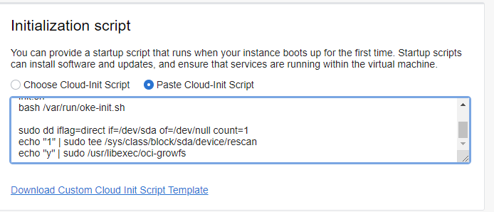

保存。

##### Step 3. 扩容

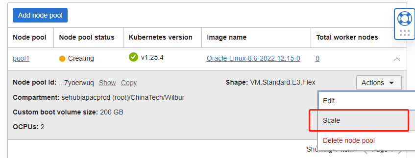

把0台扩大成2台，等待扩容完成，约5分钟左右。


##### Step4. 访问 OKE (K8s)

复制OKE的访问命令，这个命令可以帮助我们创建一个k8s config文件 (需要事先安装oci client工具，在CloudSehll已自动配置好oci client，我们之间用即可)

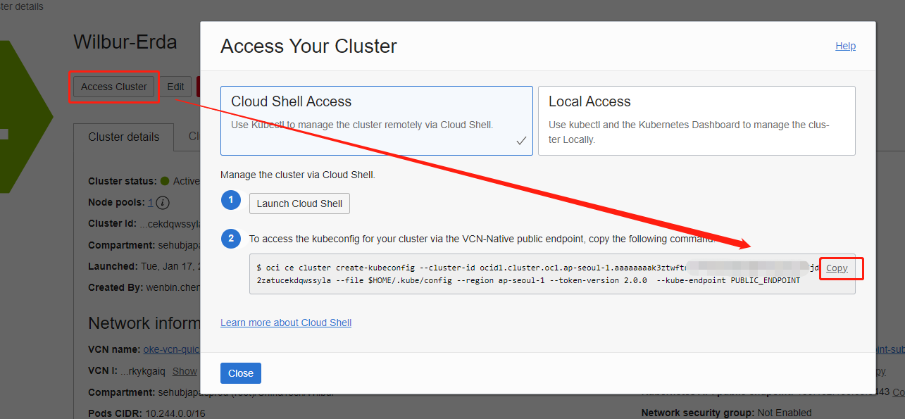

打开OCI的控制台，贴入命令后按回车执行。  现在试试访问一个kubectl命令

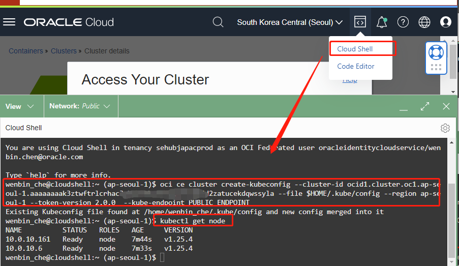

###### Step 5. 登录Worknode

执行

```shell
chmod -R 600 ~/.kube/config
kubectl get node -o wide
```

在 **EXTERNAL-IP** 列 可以看到Node的公网IP。使用ssh登录公网IP，用户名为**opc**， 方式为密钥（使用Step1中上传公钥对应的密钥），端口22

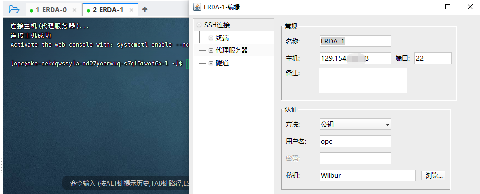


```shell
sudo vim /etc/crio/crio.conf
```

在末尾添加

```properties
insecure_registries = ["0.0.0.0/0"]
```

保存并执行

```shell
sudo systemctl daemon-reload
sudo systemctl restart crio
sudo systemctl status crio
```


## 安装ERDA

##### Step 1. 安装Ingress

ERDA依赖Ingress，先装它

```shell
kubectl create clusterrolebinding <my-cluster-admin-binding> --clusterrole=cluster-admin --user=<user-OCID>
#比如 kubectl create clusterrolebinding jdoe_clst_adm --clusterrole=cluster-admin --user=ocid1.user.oc1..fmgq

kubectl apply -f https://raw.githubusercontent.com/kubernetes/ingress-nginx/controller-v1.5.1/deploy/static/provider/cloud/deploy.yaml
```

##### Step 2. 安装Kubeprober


```shell
kubectl apply -f https://raw.githubusercontent.com/erda-project/kubeprober/master/deployment/probe-agent-standalone.yaml
```


##### Step 2. 修改ERDA

ERDA最高支持 K8s 1.20版本。  我们创建的OKE中K8s是1.25版本，要调整部分内容。 在OCI Cloud Shell中执行

```shell
helm repo add erda https://charts.erda.cloud/erda
helm repo update
helm pull erda/erda
tar xzvf erda-2.2.0.tgz
```


打开OCI右上角Editoer，编辑 erda/crds/erda_crd.yaml。因为K8s 1.22版本不再支持Beta版的CRD，所以将CRD格式调整为以下内容

```shell
apiVersion: apiextensions.k8s.io/v1
kind: CustomResourceDefinition
metadata:
  name: erdas.erda.terminus.io
spec:
  group: erda.terminus.io
  names:
    kind: Erda
    plural: erdas
    singular: erda
  scope: Namespaced
  versions:
    - name: v1beta1
      served: true
      storage: true
      schema:
        openAPIV3Schema:
          type: object
      additionalPrinterColumns:
        - name: Status
          type: string
          jsonPath: .status.phase
          description: Erda cluster current status
        - name: LastMessage
          type: string
          jsonPath: .status.conditions[0].reason
          description: last message
      subresources:
        status: {}
```


##### Step 3. 安装Erda

```shell
cd erda
helm install erda ./  -n erda-system --create-namespace
```


Erda-Redis-Operator、Erda-Operator出错，Cassandra和Buildkitsd没有创建出来


##### 尝试装Redis哨兵版

```shell
helm repo add redis-operator https://spotahome.github.io/redis-operator
helm repo update
helm install redis-operator redis-operator/redis-operator -n erda-system
```


## 相关材料

* ERDA安装说明：https://docs.erda.cloud/2.2/manual/install/helm-install/helm-install-demo.html
* K8s CRD定义：https://kubernetes.io/docs/reference/kubernetes-api/extend-resources/custom-resource-definition-v1/