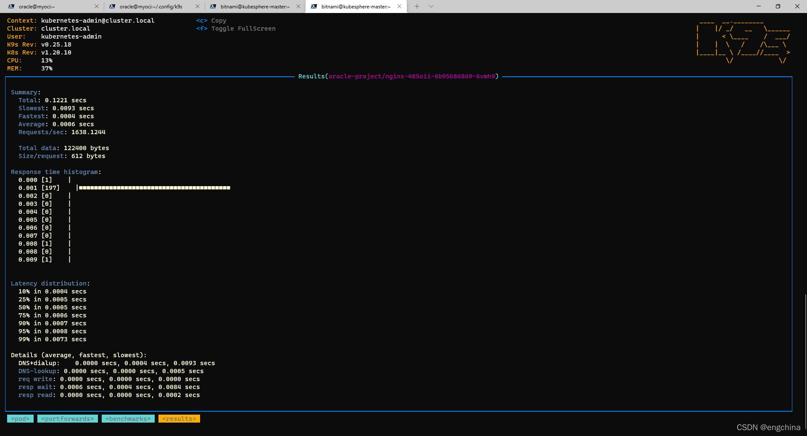

[返回OKE中文文档集](../README.md)

# 安装k9s

0. 什么是k9s？

   k9s是一个基于终端的UI，用于与你的Kubernetes集群互动。这个项目的目的是使其更容易导航、观察和管理你在kubernetes集群部署的应用程序。k9s持续观察Kubernetes的变化，并提供后续的命令来与你观察到的资源进行互动。


1. 安装k9s

   ```
   curl -sS https://webinstall.dev/k9s | bash
   ```


2. 命令

   ```
   # 列出所有可用的 CLI 选项
   k9s help
   # 获取有关 K9s 运行时间的信息（日志、配置等）。
   k9s info
   # 在一个现有的kubeconfig上下文中启动k9s
   k9s --context <your_context>
   # 在指定的命名空间中运行k9s
   k9s -n <your_namespace>
   # 以只读模式启动K9s--禁用所有集群修改命令
   k9s --readonly
   ```


3. 体验k9s（基于一个kubernetes集群，每个kubernetes集群运行的应用都不一样，仅供参考）

   ```
   # 启动k9s
   k9s
   # 退出k9s
   q 或者 quit
   ```

   3-1. 输入`0`，显示所有namespace的pod。

      


   3-2. 输入`2`，显示namespace为oracle-project的pod。

   


   3-3. 选择某个pod，输入`l`，显示这个pod的日志。单击`esc`返回。

   
   

   

   3-4. 选择某个pod，输入`d`，describe这个pod。单击`esc`返回。

   
   


   3-5. 输入`:svc`或者`:service`，跳转到service视图。


   


   3-6. 输入`:deploy`或`:deployment`，跳转到deployment视图。


   

   3-7. 输入`:rb`，跳转到角色绑定视图，用于基于角色的访问控制（RBAC）管理。
   
   


   3-8. 输入`:ns`或`:namespace`，跳转到命名空间视图。

   


   3-9. 输入`:cj`或`:cronjob`，跳转到cronjob视图。

   


   3-10. 输入`pu`或`pulses`，显示集群资源概览。

   

   3-11. 输入`:xray RESOURCE [NAMESPACE]`，显示集群资源关联关系。RESOURCE可以是po, svc, dp, rs, sts, ds中的一个，NAMESPACE是可选的。以`:xray deploy oracle-project`为例。

   


   3-12. k9s与Popeye集成，Popeye是一个Kubernetes集群净化器（sanitizer）。输入`:pop`或`:popeye`，显示Popeye的检测结果。

   


   3-13. k9s整合了Hey可以进行性能测试。Hey是一个CLI工具，用于对HTTP端点进行基准测试，类似于AB bench。这个初步的功能目前支持对端口转发和服务进行基准测试。

   最初，这些基准将以下列默认值运行。

   - 并发级别：`1`
   - 请求数：`200`
   - HTTP动词：`GET`
   - 路径：`/`

   要设置一个端口转发，你需要导航到PodView，选择一个pod和一个暴露于特定端口的容器。使用`SHIFT-F`，会出现一个对话框，让你指定一个本地端口进行转发。一旦确认，你可以输入`f`导航到PortForward视图，列出你的活动端口转发。选择一个端口转发并使用`CTRL-L`将在该HTTP端点上运行一个基准测试。要查看基准运行的结果，请进入Benchmarks视图（别名`be`）。现在你应该能够选择一个基准，并按`<ENTER>`查看运行统计的细节。注意：端口转发只在k9s会话期间持续，退出时将被终止。   

   
   

      

   
   

   

   

   更多特性和功能请访问官方或github获得，

- [https://k9scli.io/](https://k9scli.io/)
- [https://github.com/derailed/k9s](https://github.com/derailed/k9s)


[返回OKE中文文档集](../README.md)

