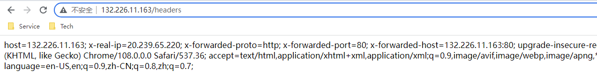
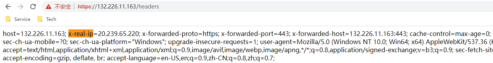
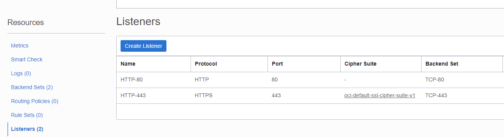

[返回OKE中文文档集](../README.md)

# 服务类型为LoadBalancer时如何获取源IP
OKE使用OCI LB（也可以是NLB）作为K8s的Loadbalancer的实现，本文介绍如何在OKE Loadblancer中获取源IP。分以下几种情况分别描述：
* HTTP LB
* HTTPS LB 
* Ingress

## 1. 通过 HTTP LB 的获取源IP

在LB Service的注解中添加：
```yaml
kind: Service
apiVersion: v1
metadata:
  name: k8s-network-checking-service
  annotations:
    oci.oraclecloud.com/load-balancer-type: "lb"
    service.beta.kubernetes.io/oci-load-balancer-backend-protocol: "HTTP"
spec:
  selector:
    app: k8s-network-checking
  type: LoadBalancer
  ports:
  - name: http
    port: 80
    targetPort: 8080
```
完整的示例：[lb-http-headers.yaml](lb-http-headers.yaml)
```shell
kubectl apply -f lb-http-headers.yaml
```




## 2. 通过 HTTPS LB 的获取源IP

当需要HTTPS终结在LB时，可以用以下方式获取源IP
```yaml
kind: Service
apiVersion: v1
metadata:
  name: k8s-network-checking-service
  annotations:
    oci.oraclecloud.com/load-balancer-type: "lb"
    service.beta.kubernetes.io/oci-load-balancer-backend-protocol: "HTTP"
    service.beta.kubernetes.io/oci-load-balancer-ssl-ports: "443"
    service.beta.kubernetes.io/oci-load-balancer-tls-secret: ssl-certificate-secret
spec:
  selector:
    app: k8s-network-checking
  type: LoadBalancer
  ports:
  - name: https
    port: 443
    targetPort: 8080
```
完整的示例：[lb-http-headers.yaml](lb-http-headers.yaml)
```shell
openssl req -x509 -nodes -days 365 -newkey rsa:2048 -keyout tls.key -out tls.crt -subj "/CN=nginxsvc/O=nginxsvc"

kubectl create secret tls ssl-certificate-secret --key tls.key --cert tls.crt

kubectl apply -f lb-https-headers.yaml
```




## 3. HTTP 与 HTTPS并存

完整的示例：[lb-http-https-headers.yaml](lb-http-https-headers.yaml)



## 4. 通过 Ingress 的获取源IP

Ingress 也是依赖OCI LB，所以还是需要配置第1 或第2步 中对LB的配置。
在用了Ingress的Pod中，Java使用以下代码获取源IP, 其他语言类似
```java
request.getRemoteAddr() 
```


参考文档：

- [OCI-Defining Kubernetes Services of Type LoadBalancer](https://docs.oracle.com/en-us/iaas/Content/ContEng/Tasks/contengcreatingloadbalancer.htm)

- [Nginx Ingress Controller source IP](https://kubernetes.github.io/ingress-nginx/user-guide/miscellaneous/)

- 示例中获取Headers的代码:

  ```java
  import jakarta.servlet.http.HttpServletRequest;
  import org.springframework.web.bind.annotation.GetMapping;
  import org.springframework.web.bind.annotation.RestController;
  import java.util.Enumeration;
  
  @RestController
  public class HeaderController {
  
      @GetMapping("/headers")
      public String getHeaders(HttpServletRequest request){
          StringBuilder stringBuilder = new StringBuilder();
          Enumeration<String> headerNames = request.getHeaderNames();
          while (headerNames.hasMoreElements()) {
              String name  = headerNames.nextElement();
              String value = request.getHeader(name);
              stringBuilder.append(name).append("=").append(value).append("; ");
          }
          return stringBuilder.toString();
  
      }
  }
  ```

  


[返回OKE中文文档集](../README.md)