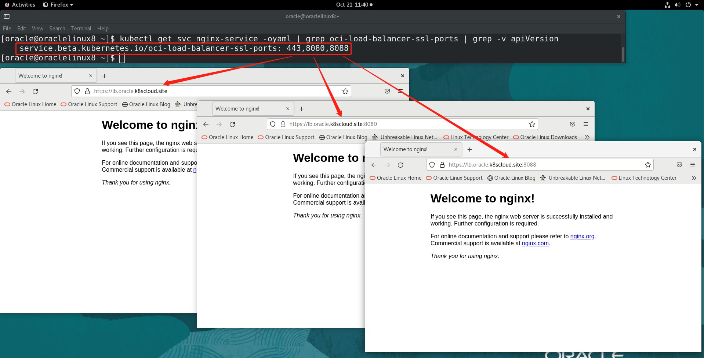

[返回OKE中文文档集](../README.md)

# 服务类型为LoadBalancer时如何设置SSL端口为非443的值

使用OKE时，可以通过使用注解将服务类型为LoadBalancer的SSL端口设置为非443的值。并且，可以通过逗号分隔，使用多个端口。在`spec.port`处，也需要相应的定义多个端口配合这个注解一起使用。

示例，

```
  annotations:
    service.beta.kubernetes.io/oci-load-balancer-ssl-ports: "443,8080,8088"
```

我们部署一个nginx应用检证一下，

`nginx.yaml`

```
cat <<EOF | kubectl apply -f -
apiVersion: apps/v1
kind: Deployment
metadata:
  name: nginx-deployment
spec:
  replicas: 2
  selector:
    matchLabels:
      app: nginx
  template:
    metadata:
      labels:
        app: nginx
    spec:
      containers:
      - name: nginx
        image: nginx
        ports:
        - containerPort: 80
---
kind: Service
apiVersion: v1
metadata:
  name: nginx-service
  annotations:
    oci.oraclecloud.com/load-balancer-type: "lb"
    service.beta.kubernetes.io/oci-load-balancer-ssl-ports: "443,8080,8088"
    service.beta.kubernetes.io/oci-load-balancer-tls-secret: server-secret
spec:
  selector:
    app: nginx
  type: LoadBalancer
  ports:
  - name: http
    port: 80
    targetPort: 80
  - name: https
    port: 443
    targetPort: 80
  - name: https8080
    port: 8080
    targetPort: 80
  - name: https8088
    port: 8088
    targetPort: 80
EOF
```

验证结果，



完结！

[返回OKE中文文档集](../README.md)