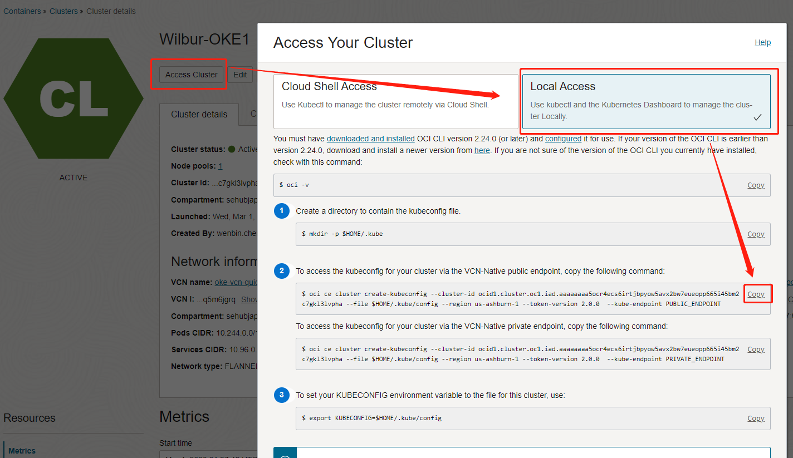
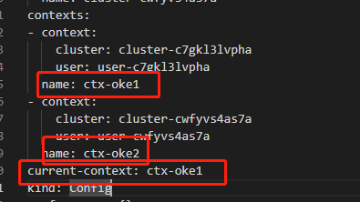

# Istio管理多个OKE集群

##### 安装oci cli

```shell
sudo dnf -y install oraclelinux-developer-release-el8
sudo dnf -y install python36-oci-cli
```

普通Linux执行如下：

```shell
bash -c "$(curl -L https://raw.githubusercontent.com/oracle/oci-cli/master/scripts/install/install.sh)"
sudo pip3 uninstall cryptography
sudo pip3 install cryptography==36.0.2
```

上传你的~/.oci/中的内容，包括一个config和一个私钥

##### 下载kubectl

```shell
curl -LO "https://dl.k8s.io/release/$(curl -L -s https://dl.k8s.io/release/stable.txt)/bin/linux/amd64/kubectl"
sudo chmod +x kubectl
sudo mv kubectl /usr/local/bin/
sudo ls /usr/local/bin/kubectl /usr/local/bin/k
```

##### 下载istio-ctl

```shell
curl -L https://istio.io/downloadIstio | sh -
vim ~/.bash_profile
```

##### 设置变量

```shell
export PATH="$PATH:/home/opc/tools/istio-1.17.1/bin"
export CTX_CLUSTER1=ctx-oke1
export CTX_CLUSTER2=ctx-oke2
export CTX_CLUSTER3=ctx-oke3
export CTX_CLUSTER4=ctx-oke4
```

##### 配置OKE

换成你的，2 个集群都执行一次，



然后编辑 ~/.kube/config，把上下文名称改成ctx-oke1和ctx-oke2



##### 加速访问（失败）

通过token认证的方式来加速OKE集群的访问

```shell
cat <<EOF > oke-admin.yaml
apiVersion: v1
kind: ServiceAccount
metadata:
  name: oke-admin
  namespace: kube-system
---
apiVersion: rbac.authorization.k8s.io/v1
kind: ClusterRoleBinding
metadata:
  name: oke-admin-crb
roleRef:
  apiGroup: rbac.authorization.k8s.io
  kind: ClusterRole
  name: cluster-admin
subjects:
  - kind: ServiceAccount
    name: oke-admin
    namespace: kube-system
EOF
```

查看旧的上下文名称

```shell
 cat ~/.kube/config |grep context
```

创建Token

```shell
kubectl apply -f oke-admin.yaml --context=<your-old-oke-context>
kubectl create token oke-admin --duration=999999h -n kube-system
export OKEADMINTOKEN=<your-oke-admin-token>
kubectl config set-credentials oke-admin --token=$OKEADMINTOKEN
kubectl config set-context ctx-oke1 --cluster=$OKECLUSTERNAME --user=oke-admin
```

设置默认集群

```shell
kubectl config use-context ctx-oke1
```


###### 安装Ingress

```shell
helm repo add nginx-stable https://helm.nginx.com/stable
helm repo update
helm install nginx-ingress nginx-stable/nginx-ingress
kubectl get ingressclass
```

使用Ingress(把域名替换成自己的域名)

```shell
apiVersion: networking.k8s.io/v1
kind: Ingress
metadata:
  name: istio-ingress
  namespace: sample
spec:
  ingressClassName: nginx
  rules:
  - host: istio.oracle.fit
    http:
      paths:
      - backend:
          service:
            name: helloworld
            port:
              number: 5000
        path: /
        pathType: Prefix
```

##### 下载Istio Sample

```shell
wget https://codeload.github.com/istio/istio/zip/refs/heads/master -O istio.zip
unzip istio.zip
```


##### 准备证书

准备证书

```shell
mkdir -p certs
pushd certs
make -f ../tools/certs/Makefile.selfsigned.mk root-ca
make -f ../tools/certs/Makefile.selfsigned.mk cluster1-cacerts
make -f ../tools/certs/Makefile.selfsigned.mk cluster2-cacerts
make -f ../tools/certs/Makefile.selfsigned.mk cluster3-cacerts
make -f ../tools/certs/Makefile.selfsigned.mk cluster4-cacerts
```


## 同网多主


准备文件：

```shell
cat <<EOF > multi-primary-cluster1.yaml
apiVersion: install.istio.io/v1alpha1
kind: IstioOperator
spec:
  values:
    global:
      meshID: mesh1
      multiCluster:
        clusterName: cluster1
      network: network1
EOF

cat <<EOF > multi-primary-cluster2.yaml
apiVersion: install.istio.io/v1alpha1
kind: IstioOperator
spec:
  values:
    global:
      meshID: mesh1
      multiCluster:
        clusterName: cluster2
      network: network1
EOF
```

安装Istio：

```shell
kubectl create --context="${CTX_CLUSTER1}" namespace istio-system
kubectl create --context="${CTX_CLUSTER2}" namespace istio-system
kubectl create --context="${CTX_CLUSTER1}" secret generic cacerts -n istio-system \
      --from-file=certs/cluster1/ca-cert.pem \
      --from-file=certs/cluster1/ca-key.pem \
      --from-file=certs/cluster1/root-cert.pem \
      --from-file=certs/cluster1/cert-chain.pem
kubectl create --context="${CTX_CLUSTER2}" secret generic cacerts -n istio-system \
      --from-file=certs/cluster2/ca-cert.pem \
      --from-file=certs/cluster2/ca-key.pem \
      --from-file=certs/cluster2/root-cert.pem \
      --from-file=certs/cluster2/cert-chain.pem

kubectl --context="${CTX_CLUSTER1}" get namespace istio-system && \
  kubectl --context="${CTX_CLUSTER1}" label namespace istio-system topology.istio.io/network=network1
kubectl --context="${CTX_CLUSTER2}" get namespace istio-system && \
  kubectl --context="${CTX_CLUSTER2}" label namespace istio-system topology.istio.io/network=network1
  

istioctl install --context="${CTX_CLUSTER1}" -f multi-primary-cluster1.yaml
y
istioctl install --context="${CTX_CLUSTER2}" -f multi-primary-cluster2.yaml
y
istioctl x create-remote-secret --context="${CTX_CLUSTER1}" --name=cluster1 | kubectl apply -f - --context="${CTX_CLUSTER2}"
istioctl x create-remote-secret --context="${CTX_CLUSTER2}" --name=cluster2 | kubectl apply -f - --context="${CTX_CLUSTER1}"
```

验证

```shell
kubectl create --context="${CTX_CLUSTER1}" namespace sample
kubectl create --context="${CTX_CLUSTER2}" namespace sample
kubectl label --context="${CTX_CLUSTER1}" namespace sample istio-injection=enabled
kubectl label --context="${CTX_CLUSTER2}" namespace sample istio-injection=enabled
kubectl apply --context="${CTX_CLUSTER1}" -f samples/helloworld/helloworld.yaml -l service=helloworld -n sample
kubectl apply --context="${CTX_CLUSTER2}" -f samples/helloworld/helloworld.yaml -l service=helloworld -n sample
kubectl apply --context="${CTX_CLUSTER1}" -f samples/helloworld/helloworld.yaml -l version=v1 -n sample
kubectl apply --context="${CTX_CLUSTER2}" -f samples/helloworld/helloworld.yaml -l version=v2 -n sample
kubectl apply --context="${CTX_CLUSTER1}" -f samples/sleep/sleep.yaml -n sample
kubectl apply --context="${CTX_CLUSTER2}" -f samples/sleep/sleep.yaml -n sample
kubectl get pod --context="${CTX_CLUSTER1}" -n sample -o wide
kubectl get pod --context="${CTX_CLUSTER2}" -n sample -o wide
kubectl get svc --context="${CTX_CLUSTER1}" -n sample -o wide
kubectl get svc --context="${CTX_CLUSTER2}" -n sample -o wide

```

验证跨云流量

```shell
kubectl exec --context="${CTX_CLUSTER1}" -n sample -c sleep "$(kubectl get pod --context="${CTX_CLUSTER1}" -n sample -l app=sleep -o jsonpath='{.items[0].metadata.name}')" -- curl -sS helloworld.sample:5000/hello

kubectl exec --context="${CTX_CLUSTER2}" -n sample -c sleep "$(kubectl get pod --context="${CTX_CLUSTER2}" -n sample -l app=sleep -o jsonpath='{.items[0].metadata.name}')" -- curl -sS helloworld.sample:5000/hello

```


##### 问题分析

```shell
kubectl create --context="${CTX_CLUSTER1}" namespace uninjected-sample
kubectl create --context="${CTX_CLUSTER2}" namespace uninjected-sample

kubectl apply --context="${CTX_CLUSTER1}" \
  -f samples/helloworld/helloworld.yaml \
  -l service=helloworld -n uninjected-sample
kubectl apply --context="${CTX_CLUSTER2}" \
  -f samples/helloworld/helloworld.yaml \
  -l service=helloworld -n uninjected-sample
kubectl apply --context="${CTX_CLUSTER1}" \
  -f samples/helloworld/helloworld.yaml \
  -l version=v1 -n uninjected-sample
kubectl apply --context="${CTX_CLUSTER2}" \
  -f samples/helloworld/helloworld.yaml \
  -l version=v2 -n uninjected-sample
kubectl apply --context="${CTX_CLUSTER1}" \
  -f samples/sleep/sleep.yaml -n uninjected-sample
kubectl apply --context="${CTX_CLUSTER2}" \
  -f samples/sleep/sleep.yaml -n uninjected-sample
  
kubectl --context="${CTX_CLUSTER2}" -n uninjected-sample get pod -o wide
#记录helloworld的ClusterIP
kubectl exec --context="${CTX_CLUSTER1}" -n uninjected-sample -c sleep \
    "$(kubectl get pod --context="${CTX_CLUSTER1}" -n uninjected-sample -l \
    app=sleep -o jsonpath='{.items[0].metadata.name}')" -it -- /bin/sh
curl -sS <helloworld的ClusterIP>:5000/hello
#If this succeeds, you can rule out connectivity issues. If it does not, the cause of the problem may lie outside your Istio configuration.
```


# 跨网络多主


```shell
cat <<EOF > multi-primary-cluster3.yaml
apiVersion: install.istio.io/v1alpha1
kind: IstioOperator
spec:
  values:
    global:
      meshID: mesh2
      multiCluster:
        clusterName: cluster3
      network: network3
EOF

cat <<EOF > multi-primary-cluster4.yaml
apiVersion: install.istio.io/v1alpha1
kind: IstioOperator
spec:
  values:
    global:
      meshID: mesh2
      multiCluster:
        clusterName: cluster4
      network: network4
EOF
```


安装

```shell
kubectl create --context="${CTX_CLUSTER3}" namespace istio-system
kubectl create --context="${CTX_CLUSTER4}" namespace istio-system
kubectl create --context="${CTX_CLUSTER3}" secret generic cacerts -n istio-system \
      --from-file=certs/cluster3/ca-cert.pem \
      --from-file=certs/cluster3/ca-key.pem \
      --from-file=certs/cluster3/root-cert.pem \
      --from-file=certs/cluster3/cert-chain.pem
kubectl create --context="${CTX_CLUSTER4}" secret generic cacerts -n istio-system \
      --from-file=certs/cluster4/ca-cert.pem \
      --from-file=certs/cluster4/ca-key.pem \
      --from-file=certs/cluster4/root-cert.pem \
      --from-file=certs/cluster4/cert-chain.pem
      

kubectl --context="${CTX_CLUSTER3}" get namespace istio-system && \
  kubectl --context="${CTX_CLUSTER3}" label namespace istio-system topology.istio.io/network=network3
kubectl --context="${CTX_CLUSTER4}" get namespace istio-system && \
  kubectl --context="${CTX_CLUSTER4}" label namespace istio-system topology.istio.io/network=network4


istioctl install --context="${CTX_CLUSTER3}" -f multi-primary-cluster3.yaml
y
istioctl install --context="${CTX_CLUSTER4}" -f multi-primary-cluster4.yaml
y

samples/multicluster/gen-eastwest-gateway.sh \
    --mesh mesh2 --cluster cluster3 --network network3 | \
    istioctl --context="${CTX_CLUSTER3}" install -y -f -
samples/multicluster/gen-eastwest-gateway.sh \
    --mesh mesh2 --cluster cluster4 --network network4 | \
    istioctl --context="${CTX_CLUSTER4}" install -y -f -
    
kubectl --context="${CTX_CLUSTER3}" get svc istio-eastwestgateway -n istio-system
kubectl --context="${CTX_CLUSTER4}" get svc istio-eastwestgateway -n istio-system

kubectl --context="${CTX_CLUSTER3}" apply -n istio-system -f \
    samples/multicluster/expose-services.yaml
kubectl --context="${CTX_CLUSTER4}" apply -n istio-system -f \
    samples/multicluster/expose-services.yaml

istioctl x create-remote-secret \
  --context="${CTX_CLUSTER3}" \
  --name=cluster3 | \
  kubectl apply -f - --context="${CTX_CLUSTER4}"
istioctl x create-remote-secret \
  --context="${CTX_CLUSTER4}" \
  --name=cluster4 | \
  kubectl apply -f - --context="${CTX_CLUSTER3}"
```


测试

```shell
kubectl create --context="${CTX_CLUSTER3}" namespace sample
kubectl create --context="${CTX_CLUSTER4}" namespace sample
kubectl label --context="${CTX_CLUSTER3}" namespace sample istio-injection=enabled
kubectl label --context="${CTX_CLUSTER4}" namespace sample istio-injection=enabled
kubectl apply --context="${CTX_CLUSTER3}" -f samples/helloworld/helloworld.yaml -l service=helloworld -n sample
kubectl apply --context="${CTX_CLUSTER4}" -f samples/helloworld/helloworld.yaml -l service=helloworld -n sample
kubectl apply --context="${CTX_CLUSTER3}" -f samples/helloworld/helloworld.yaml -l version=v1 -n sample
kubectl apply --context="${CTX_CLUSTER4}" -f samples/helloworld/helloworld.yaml -l version=v2 -n sample
kubectl apply --context="${CTX_CLUSTER3}" -f samples/sleep/sleep.yaml -n sample
kubectl apply --context="${CTX_CLUSTER4}" -f samples/sleep/sleep.yaml -n sample
kubectl get pod --context="${CTX_CLUSTER3}" -n sample -o wide
kubectl get pod --context="${CTX_CLUSTER4}" -n sample -o wide
kubectl get svc --context="${CTX_CLUSTER3}" -n sample -o wide
kubectl get svc --context="${CTX_CLUSTER4}" -n sample -o wide
```

验证

```shell
kubectl exec --context="${CTX_CLUSTER3}" -n sample -c sleep "$(kubectl get pod --context="${CTX_CLUSTER3}" -n sample -l app=sleep -o jsonpath='{.items[0].metadata.name}')" -- curl -sS helloworld.sample:5000/hello

kubectl exec --context="${CTX_CLUSTER4}" -n sample -c sleep "$(kubectl get pod --context="${CTX_CLUSTER4}" -n sample -l app=sleep -o jsonpath='{.items[0].metadata.name}')" -- curl -sS helloworld.sample:5000/hello

kubectl exec --context="${CTX_CLUSTER3}" -n sample -c sleep "$(kubectl get pod --context="${CTX_CLUSTER3}" -n sample -l app=sleep -o jsonpath='{.items[0].metadata.name}')" -it -- /bin/sh
kubectl exec --context="${CTX_CLUSTER4}" -n sample -c sleep "$(kubectl get pod --context="${CTX_CLUSTER4}" -n sample -l app=sleep -o jsonpath='{.items[0].metadata.name}')" -it -- /bin/sh

```


# 卸载

```shell
istioctl uninstall --context="${CTX_CLUSTER3}" -f multi-primary-cluster3.yaml
istioctl uninstall --context="${CTX_CLUSTER4}" -f multi-primary-cluster4.yaml
kubectl --context="${CTX_CLUSTER3}" delete namespace sample
kubectl --context="${CTX_CLUSTER4}" delete namespace sample
kubectl --context="${CTX_CLUSTER3}" delete namespace istio-system
kubectl --context="${CTX_CLUSTER4}" delete namespace istio-system
```

