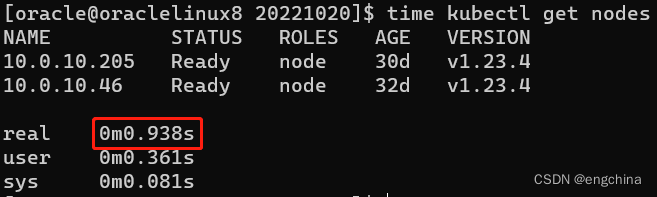
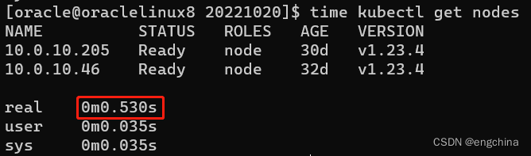

[返回OKE中文文档集](../README.md)

# 通过token认证的方式来加速OKE集群的访问

Oracle云的托管型Kubernetes集群(简称:OKE)，可以通过OCI CLI命令来创建config文件，然后通过kubectl命令来访问OKE集群。

OCI CLI创建的config文件里面的user信息实际上是一条获取token的OCI CLI命令，每次通过kubectl访问OKE集群时，这条OCI CLI命令都会被执行，这是一种非常安全的使用方式。但是，由于这条OCI CLI每次都会被执行，也带来了一些OKE集群访问上的迟延。

这种情况下，我们可以使用token认证的方式，通过在config文件里面新加一个user信息和context信息来加速OKE集群的访问。

首先，我们已经通过OCI CLI命令创建了config文件，可以通过cat命令查看config文件的内容，

```shell
cat $HOME/.kube/config
```

输入结果如下(示例)，

```
apiVersion: v1
clusters:
- cluster:
    certificate-authority-data: (略)
    server: https://xxx.xxx.xxx.xxx:6443
  name: cluster-caupf5xf2pq
contexts:
- context:
    cluster: cluster-caupf5xf2pq
    user: user-caupf5xf2pq
  name: context-caupf5xf2pq
current-context: caupf5xf2pq
kind: Config
preferences: {}
users:
- name: user-caupf5xf2pq
  user:
    exec:
      apiVersion: client.authentication.k8s.io/v1beta1
      args:
      - ce
      - cluster
      - generate-token
      - --cluster-id
      - ocid1.cluster.oc1.ap-chuncheon-1.略
      - --region
      - ap-chuncheon-1
      command: oci
      env: []
      interactiveMode: IfAvailable
      provideClusterInfo: false
```
确认基于OCI CLI认证方式时，执行kubectl命令的耗时情况，
```sh
time kubectl get nodes
```


设置一个环境变量`OKECLUSTERNAME`，它的值设置为OKE集群的名称，

```
export OKECLUSTERNAME=<your-oke-cluster-name>
```

示例，

```
export OKECLUSTERNAME=cluster-caupf5xf2pq
```

在kube-system的命名空间下面，创建一个名为`oke-admin`的ServiceAccount，

```
cat <<EOF | kubectl apply -f - 
apiVersion: v1
kind: ServiceAccount
metadata:
  name: oke-admin
  namespace: kube-system
EOF
```

为oke-admin赋予`cluster-admin`的ClusterRole，创建一个名为`oke-admin-crb`的ClusterRoleBinding，

```
cat <<EOF | kubectl apply -f - 
apiVersion: rbac.authorization.k8s.io/v1
kind: ClusterRoleBinding
metadata:
  name: oke-admin-crb
roleRef:
  apiGroup: rbac.authorization.k8s.io
  kind: ClusterRole
  name: cluster-admin
subjects:
  - kind: ServiceAccount
    name: oke-admin
    namespace: kube-system
EOF
```

根据OKE集群的版本不同通过获取token的方式会有些不同。

如果OKE集群的版本`>=1.24`(请确保kubectl的版本也必须`>=1.24`)，执行下面命令创建并同时获取token，

- --duration: 设置token的有效时间，请根据实际情况调整

```
kubectl create token oke-admin --duration=999999h -n kube-system
```

如果OKE集群的版本`<=1.23`，执行下面命令获取token，

- --duration: 设置token的有效时间，请根据实际情况调整

```
kubectl -n kube-system describe secret $(kubectl -n kube-system get secret | grep oke-admin | awk '{print $1}')
```

设置一个环境变量`OKEADMINTOKEN`，它的值设置为OKE集群的名称，

```
export OKEADMINTOKEN=<your-oke-admin-token>
```

在config文件中创建一个新的user信息`oke-admin`，token的值设置为`OKEADMINTOKEN`的值，

```
kubectl config set-credentials oke-admin --token=$OKEADMINTOKEN
```

在config文件中创建一个新的context信息`oke-admin@oke-cluster`，cluster的值设置为`OKECLUSTERNAME`的值，user的值设置为`oke-admin`，

```
kubectl config set-context oke-admin@oke-cluster --cluster=$OKECLUSTERNAME --user=oke-admin
```

设置config文件中默认的context为`oke-admin@oke-cluster`，

```
kubectl config use-context oke-admin@oke-cluster
```

接下来，我们就可以执行下面命令来验证使用token认证的方式访问OKE集群的速度了。

```
time kubectl get nodes
```



完结！

[返回OKE中文文档集](../README.md)