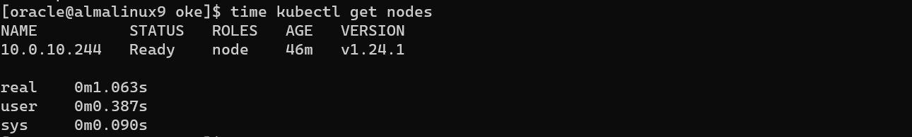
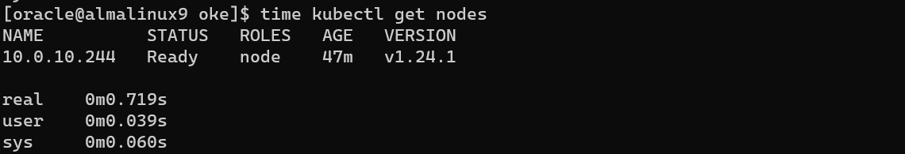

[返回OKE中文文档集](../README.md)

# 通过证书认证的方式来加速OKE集群的访问

Oracle云的托管型Kubernetes集群(简称:OKE)，可以通过OCI CLI命令来创建config文件，然后通过kubectl命令来访问OKE集群。

OCI CLI创建的config文件里面的user信息实际上是一条获取token的OCI CLI命令，每次通过kubectl访问OKE集群时，这条OCI CLI命令都会被执行，这是一种非常安全的使用方式。但是，由于这条OCI CLI每次都会被执行，也带来了一些OKE集群访问上的迟延。

这种情况下，我们可以使用证书认证的方式，通过在config文件里面新加一个user信息和context信息来加速OKE集群的访问。

首先，我们先创建证书请求，CN和O改成你创建证书想使用的信息，CN名称会成为OKE认证是的用户名，

```
mkdir oke; cd oke
export CN=oke-admin
export O=oke-admin-group
```

```
openssl genrsa -out id_rsa.pri 2048
cat <<EOF > csr.conf
[ req ]
default_bits = 2048
prompt = no
default_md = sha256
distinguished_name = dn
[ dn ]
CN = $CN
O = $O
[ v3_ext ]
authorityKeyIdentifier=keyid,issuer:always
basicConstraints=CA:FALSE
keyUsage=keyEncipherment,dataEncipherment
extendedKeyUsage=clientAuth
EOF

openssl req -new -key id_rsa.pri -out id_rsa.csr -config ./csr.conf

cat <<EOF | kubectl apply -f -
apiVersion: certificates.k8s.io/v1
kind: CertificateSigningRequest
metadata:
  name: oke-admin-csr
spec:
  groups:
  - system:authenticated
  request: $(cat id_rsa.csr | base64 | tr -d '\n')
  signerName: kubernetes.io/kube-apiserver-client
  usages:
  - client auth
EOF

kubectl certificate approve oke-admin-csr
kubectl get csr oke-admin-csr -o jsonpath='{.status.certificate}' | base64 --decode > id_rsa.crt
```


其次，我们已经通过OCI CLI命令创建了config文件，可以通过cat命令查看config文件的内容，

```shell
cat $HOME/.kube/config
```

输入结果如下(示例)，

```
apiVersion: v1
clusters:
- cluster:
    certificate-authority-data: (略)
    server: https://xxx.xxx.xxx.xxx:6443
  name: cluster-caupf5xf2pq
contexts:
- context:
    cluster: cluster-caupf5xf2pq
    user: user-caupf5xf2pq
  name: context-caupf5xf2pq
current-context: caupf5xf2pq
kind: Config
preferences: {}
users:
- name: user-caupf5xf2pq
  user:
    exec:
      apiVersion: client.authentication.k8s.io/v1beta1
      args:
      - ce
      - cluster
      - generate-token
      - --cluster-id
      - ocid1.cluster.oc1.ap-chuncheon-1.略
      - --region
      - ap-chuncheon-1
      command: oci
      env: []
      interactiveMode: IfAvailable
      provideClusterInfo: false
```

确认基于OCI CLI认证方式时，执行kubectl命令的耗时情况，

```sh
time kubectl get nodes
```



设置一个环境变量`OKECLUSTERNAME`，它的值设置为OKE集群的名称，

```
export OKECLUSTERNAME=<your-oke-cluster-name>
```

示例，

```
export OKECLUSTERNAME=cluster-caupf5xf2pq
```

为oke-admin赋予`cluster-admin`的ClusterRole，创建一个名为`oke-admin-crb`的ClusterRoleBinding，

```
cat <<EOF | kubectl apply -f - 
apiVersion: rbac.authorization.k8s.io/v1
kind: ClusterRoleBinding
metadata:
  name: oke-admin-crb
roleRef:
  apiGroup: rbac.authorization.k8s.io
  kind: ClusterRole
  name: cluster-admin
subjects:
  - kind: User
    name: oke-admin
    apiGroup: rbac.authorization.k8s.io
EOF
```

在config文件中创建一个新的user信息`oke-admin`，

```
kubectl config set-credentials oke-admin --client-certificate=id_rsa.crt --client-key=id_rsa.pri --embed-certs=true
```

在config文件中创建一个新的context信息`oke-admin-at-oke-cluster`，cluster的值设置为`OKECLUSTERNAME`的值，user的值设置为`oke-admin`，

```
kubectl config set-context oke-admin-at-oke-cluster --cluster=$OKECLUSTERNAME --user=oke-admin
```

设置config文件中默认的context为`oke-admin-at-oke-cluster`，

```
kubectl config use-context oke-admin-at-oke-cluster
```

接下来，我们就可以执行下面命令来验证使用token认证的方式访问OKE集群的速度了。

```
time kubectl get nodes
```



完结！


参考文档：

- [Certificate Signing Requests | Kubernetes](https://kubernetes.io/docs/reference/access-authn-authz/certificate-signing-requests/)
- [OCI – Oracle Container Engine for Kubernetes (OKE) – Using Client Certificates and RBAC – RedThunder.Blog](https://redthunder.blog/2019/10/09/oci-oracle-container-engine-for-kubernetes-oke-using-client-certificates-and-rbac/)


[返回OKE中文文档集](../README.md)